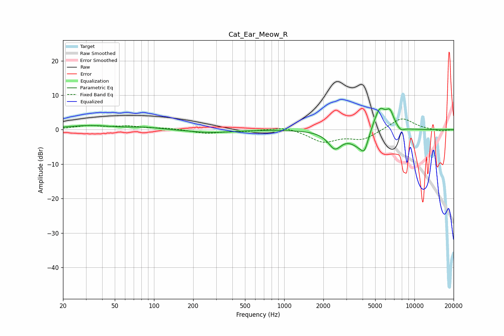

# Cat_Ear_Meow_R
See [usage instructions](https://github.com/jaakkopasanen/AutoEq#usage) for more options and info.

### Parametric EQs
Apply preamp of -6.3 dB when using parametric equalizer.

|   # | Type    |   Fc (Hz) |    Q |   Gain (dB) |
|-----|---------|-----------|------|-------------|
|   1 | Peaking |        32 | 0.78 |         1.2 |
|   2 | Peaking |        87 | 1.36 |         0.6 |
|   3 | Peaking |       273 | 0.91 |        -0.8 |
|   4 | Peaking |      2448 | 2.72 |        -4.7 |
|   5 | Peaking |      3896 | 1.91 |        -5.2 |
|   6 | Peaking |      4141 | 5.51 |        -3.1 |
|   7 | Peaking |      5007 | 2.01 |         1.8 |
|   8 | Peaking |      5431 | 3.17 |         5.7 |
|   9 | Peaking |      6491 | 4.48 |         4.2 |
|  10 | Peaking |      7855 | 5.12 |        -1.2 |

### Fixed Band EQs
When using fixed band (also called graphic) equalizer, apply preamp of **-3.2 dB** (if available) and set gains manually with these parameters.

|   # | Type    |   Fc (Hz) |    Q |   Gain (dB) |
|-----|---------|-----------|------|-------------|
|   1 | Peaking |        31 | 1.41 |         1   |
|   2 | Peaking |        62 | 1.41 |         0.9 |
|   3 | Peaking |       125 | 1.41 |         0.4 |
|   4 | Peaking |       250 | 1.41 |        -1.1 |
|   5 | Peaking |       500 | 1.41 |        -0.4 |
|   6 | Peaking |      1000 | 1.41 |         1   |
|   7 | Peaking |      2000 | 1.41 |        -3.4 |
|   8 | Peaking |      4000 | 1.41 |        -2.7 |
|   9 | Peaking |      8000 | 1.41 |         3.6 |
|  10 | Peaking |     16000 | 1.41 |        -0.5 |

### Graphs

