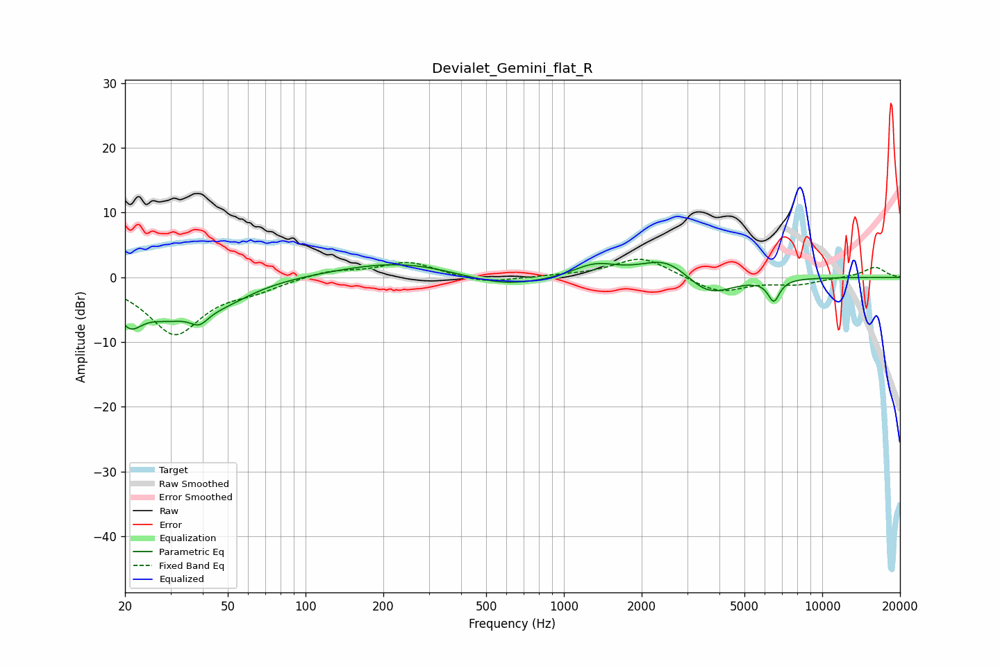

# Devialet_Gemini_flat_R
See [usage instructions](https://github.com/jaakkopasanen/AutoEq#usage) for more options and info.

### Parametric EQs
Apply preamp of -2.4 dB when using parametric equalizer.

|   # | Type    |   Fc (Hz) |    Q |   Gain (dB) |
|-----|---------|-----------|------|-------------|
|   1 | Peaking |        21 | 2.81 |        -4.9 |
|   2 | Peaking |        29 | 1.28 |        -4.3 |
|   3 | Peaking |        39 | 4.07 |        -2   |
|   4 | Peaking |        47 | 1.14 |        -2.9 |
|   5 | Peaking |       236 | 0.59 |         2.6 |
|   6 | Peaking |       582 | 0.8  |        -2   |
|   7 | Peaking |      1317 | 1.66 |         2   |
|   8 | Peaking |      2510 | 1.42 |         3.4 |
|   9 | Peaking |      3610 | 1.5  |        -3.5 |
|  10 | Peaking |      6494 | 6    |        -3.3 |

### Fixed Band EQs
When using fixed band (also called graphic) equalizer, apply preamp of **-2.9 dB** (if available) and set gains manually with these parameters.

|   # | Type    |   Fc (Hz) |    Q |   Gain (dB) |
|-----|---------|-----------|------|-------------|
|   1 | Peaking |        31 | 1.41 |        -8.7 |
|   2 | Peaking |        62 | 1.41 |        -1.4 |
|   3 | Peaking |       125 | 1.41 |         1.1 |
|   4 | Peaking |       250 | 1.41 |         2.4 |
|   5 | Peaking |       500 | 1.41 |        -1   |
|   6 | Peaking |      1000 | 1.41 |         0.2 |
|   7 | Peaking |      2000 | 1.41 |         3.2 |
|   8 | Peaking |      4000 | 1.41 |        -2.4 |
|   9 | Peaking |      8000 | 1.41 |        -1   |
|  10 | Peaking |     16000 | 1.41 |         1.6 |

### Graphs

