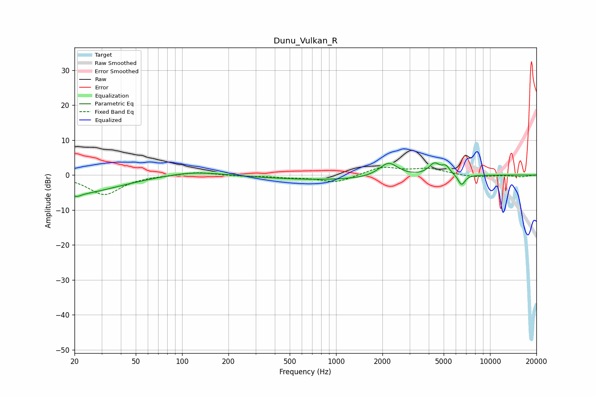

# Dunu_Vulkan_R
See [usage instructions](https://github.com/jaakkopasanen/AutoEq#usage) for more options and info.

### Parametric EQs
Apply preamp of -3.6 dB when using parametric equalizer.

|   # | Type    |   Fc (Hz) |    Q |   Gain (dB) |
|-----|---------|-----------|------|-------------|
|   1 | Peaking |        20 | 0.53 |        -5.4 |
|   2 | Peaking |        21 | 5.43 |        -0.8 |
|   3 | Peaking |       115 | 0.83 |         1.2 |
|   4 | Peaking |       180 | 1.45 |         0.1 |
|   5 | Peaking |       913 | 0.34 |        -1.4 |
|   6 | Peaking |      2193 | 2.32 |         4.2 |
|   7 | Peaking |      4348 | 3.96 |         3.2 |
|   8 | Peaking |      5165 | 5.24 |         2.2 |
|   9 | Peaking |      6534 | 6    |        -3   |
|  10 | Peaking |      6874 | 4.93 |        -0   |

### Fixed Band EQs
When using fixed band (also called graphic) equalizer, apply preamp of **-2.3 dB** (if available) and set gains manually with these parameters.

|   # | Type    |   Fc (Hz) |    Q |   Gain (dB) |
|-----|---------|-----------|------|-------------|
|   1 | Peaking |        31 | 1.41 |        -5.6 |
|   2 | Peaking |        62 | 1.41 |        -0.1 |
|   3 | Peaking |       125 | 1.41 |         0.9 |
|   4 | Peaking |       250 | 1.41 |        -0.3 |
|   5 | Peaking |       500 | 1.41 |        -0.6 |
|   6 | Peaking |      1000 | 1.41 |        -2.2 |
|   7 | Peaking |      2000 | 1.41 |         2.3 |
|   8 | Peaking |      4000 | 1.41 |         1.7 |
|   9 | Peaking |      8000 | 1.41 |        -0.7 |
|  10 | Peaking |     16000 | 1.41 |        -0.5 |

### Graphs

