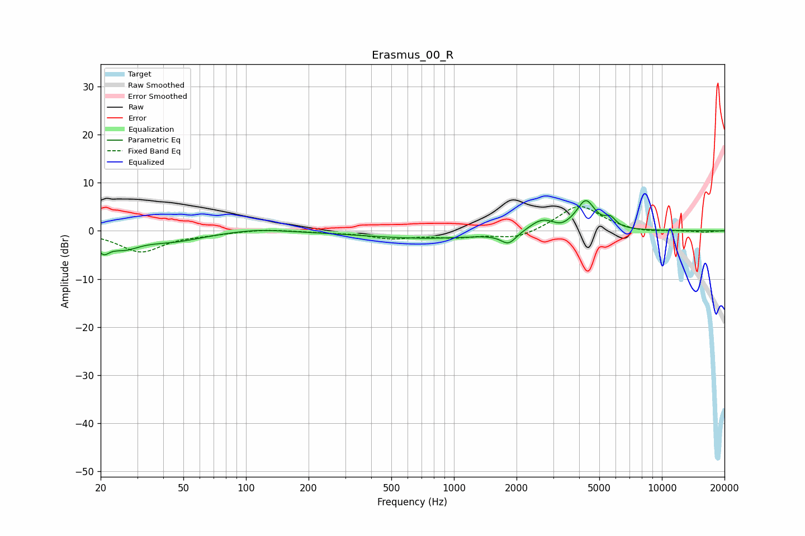

# Erasmus_00_R
See [usage instructions](https://github.com/jaakkopasanen/AutoEq#usage) for more options and info.

### Parametric EQs
Apply preamp of -6.4 dB when using parametric equalizer.

|   # | Type    |   Fc (Hz) |    Q |   Gain (dB) |
|-----|---------|-----------|------|-------------|
|   1 | Peaking |        21 | 4.92 |        -2.7 |
|   2 | Peaking |        26 | 1.78 |        -2.8 |
|   3 | Peaking |        45 | 0.98 |        -1.9 |
|   4 | Peaking |       115 | 1.15 |         0.6 |
|   5 | Peaking |       750 | 0.47 |        -1.6 |
|   6 | Peaking |      1832 | 3.8  |        -2.4 |
|   7 | Peaking |      2647 | 2.3  |         2.4 |
|   8 | Peaking |      3278 | 4.15 |        -0.6 |
|   9 | Peaking |      4307 | 3.11 |         6.1 |
|  10 | Peaking |      5646 | 5.4  |         1.8 |

### Fixed Band EQs
When using fixed band (also called graphic) equalizer, apply preamp of **-5.2 dB** (if available) and set gains manually with these parameters.

|   # | Type    |   Fc (Hz) |    Q |   Gain (dB) |
|-----|---------|-----------|------|-------------|
|   1 | Peaking |        31 | 1.41 |        -4.3 |
|   2 | Peaking |        62 | 1.41 |        -0.5 |
|   3 | Peaking |       125 | 1.41 |         0.4 |
|   4 | Peaking |       250 | 1.41 |        -0.2 |
|   5 | Peaking |       500 | 1.41 |        -1.4 |
|   6 | Peaking |      1000 | 1.41 |        -1.1 |
|   7 | Peaking |      2000 | 1.41 |        -1.8 |
|   8 | Peaking |      4000 | 1.41 |         5.5 |
|   9 | Peaking |      8000 | 1.41 |        -0.5 |
|  10 | Peaking |     16000 | 1.41 |        -0.3 |

### Graphs

