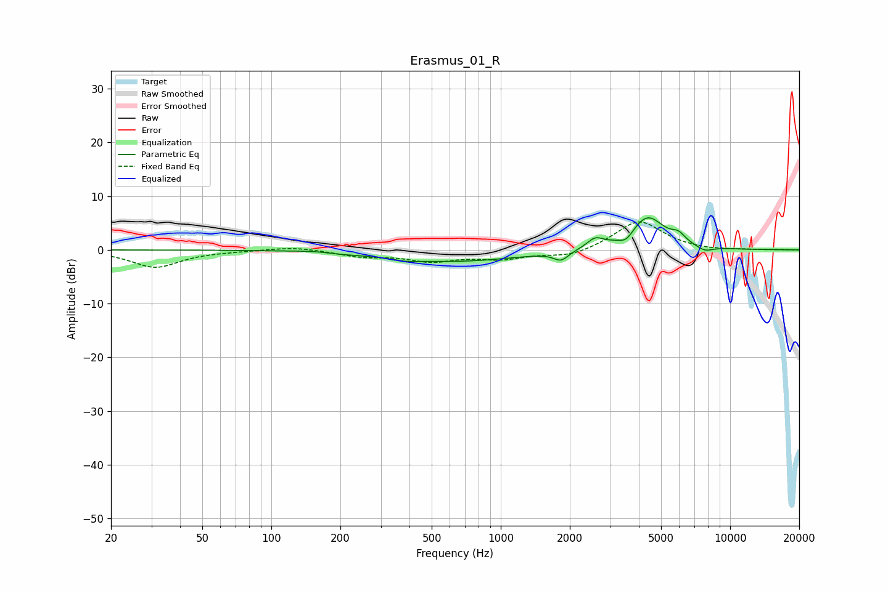

# Erasmus_01_R
See [usage instructions](https://github.com/jaakkopasanen/AutoEq#usage) for more options and info.

### Parametric EQs
Apply preamp of -6.1 dB when using parametric equalizer.

|   # | Type    |   Fc (Hz) |    Q |   Gain (dB) |
|-----|---------|-----------|------|-------------|
|   1 | Peaking |       161 | 1.7  |         0.3 |
|   2 | Peaking |       193 | 1.69 |        -0.3 |
|   3 | Peaking |       387 | 2.78 |        -0.4 |
|   4 | Peaking |       629 | 0.49 |        -2.1 |
|   5 | Peaking |      1832 | 4.35 |        -1.7 |
|   6 | Peaking |      2580 | 3.92 |         1.8 |
|   7 | Peaking |      3525 | 4.7  |        -1.5 |
|   8 | Peaking |      4358 | 1.86 |         6.2 |
|   9 | Peaking |      5953 | 4.67 |         1.5 |
|  10 | Peaking |      7744 | 3.75 |        -0.9 |

### Fixed Band EQs
When using fixed band (also called graphic) equalizer, apply preamp of **-5.3 dB** (if available) and set gains manually with these parameters.

|   # | Type    |   Fc (Hz) |    Q |   Gain (dB) |
|-----|---------|-----------|------|-------------|
|   1 | Peaking |        31 | 1.41 |        -3.2 |
|   2 | Peaking |        62 | 1.41 |        -0.1 |
|   3 | Peaking |       125 | 1.41 |         0.6 |
|   4 | Peaking |       250 | 1.41 |        -1.1 |
|   5 | Peaking |       500 | 1.41 |        -1.9 |
|   6 | Peaking |      1000 | 1.41 |        -1.5 |
|   7 | Peaking |      2000 | 1.41 |        -1.3 |
|   8 | Peaking |      4000 | 1.41 |         5.5 |
|   9 | Peaking |      8000 | 1.41 |        -0.2 |
|  10 | Peaking |     16000 | 1.41 |         0.1 |

### Graphs

