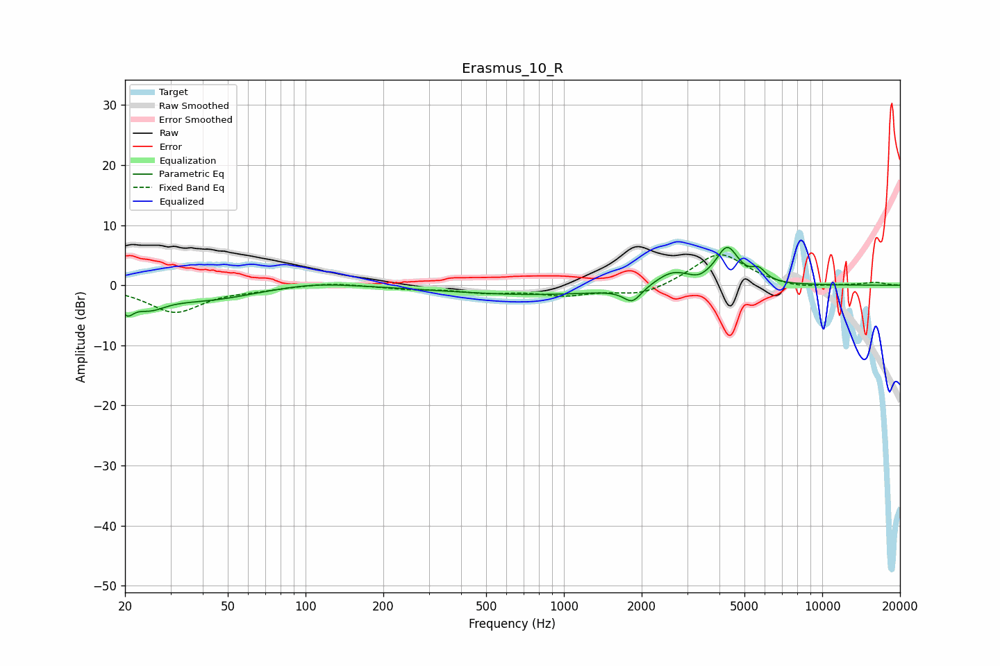

# Erasmus_10_R
See [usage instructions](https://github.com/jaakkopasanen/AutoEq#usage) for more options and info.

### Parametric EQs
Apply preamp of -6.4 dB when using parametric equalizer.

|   # | Type    |   Fc (Hz) |    Q |   Gain (dB) |
|-----|---------|-----------|------|-------------|
|   1 | Peaking |        20 | 5.56 |        -2.7 |
|   2 | Peaking |        25 | 2.19 |        -2.4 |
|   3 | Peaking |        41 | 0.74 |        -2.3 |
|   4 | Peaking |       108 | 0.92 |         0.8 |
|   5 | Peaking |       782 | 0.41 |        -1.6 |
|   6 | Peaking |      1841 | 4.1  |        -2.5 |
|   7 | Peaking |      2630 | 2.1  |         2.4 |
|   8 | Peaking |      3329 | 4.31 |        -0.5 |
|   9 | Peaking |      4290 | 3.14 |         6.1 |
|  10 | Peaking |      5677 | 5.07 |         1.8 |

### Fixed Band EQs
When using fixed band (also called graphic) equalizer, apply preamp of **-5.2 dB** (if available) and set gains manually with these parameters.

|   # | Type    |   Fc (Hz) |    Q |   Gain (dB) |
|-----|---------|-----------|------|-------------|
|   1 | Peaking |        31 | 1.41 |        -4.4 |
|   2 | Peaking |        62 | 1.41 |        -0.5 |
|   3 | Peaking |       125 | 1.41 |         0.5 |
|   4 | Peaking |       250 | 1.41 |        -0.5 |
|   5 | Peaking |       500 | 1.41 |        -1   |
|   6 | Peaking |      1000 | 1.41 |        -1.5 |
|   7 | Peaking |      2000 | 1.41 |        -1.8 |
|   8 | Peaking |      4000 | 1.41 |         5.5 |
|   9 | Peaking |      8000 | 1.41 |        -0.7 |
|  10 | Peaking |     16000 | 1.41 |         0.5 |

### Graphs

