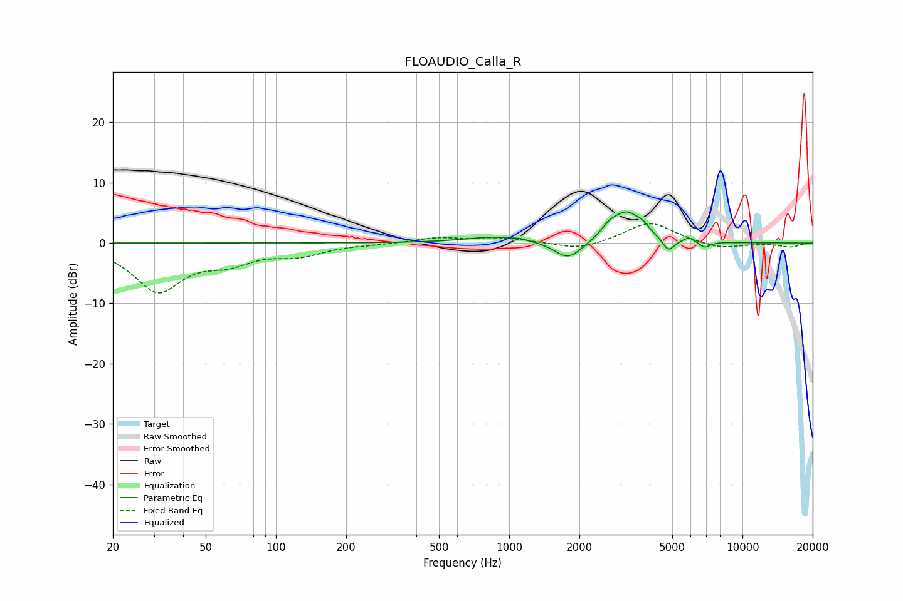

# FLOAUDIO_Calla_R
See [usage instructions](https://github.com/jaakkopasanen/AutoEq#usage) for more options and info.

### Parametric EQs
Apply preamp of -5.2 dB when using parametric equalizer.

|   # | Type    |   Fc (Hz) |    Q |   Gain (dB) |
|-----|---------|-----------|------|-------------|
|   1 | Peaking |       870 | 1.12 |         1   |
|   2 | Peaking |      1121 | 4.7  |         0.2 |
|   3 | Peaking |      1777 | 2.51 |        -2.7 |
|   4 | Peaking |      1956 | 2.17 |        -0.5 |
|   5 | Peaking |      2675 | 4.49 |         1.2 |
|   6 | Peaking |      3181 | 2.17 |         5   |
|   7 | Peaking |      3751 | 5.69 |         0.8 |
|   8 | Peaking |      4812 | 5.52 |        -2.2 |
|   9 | Peaking |      5883 | 6    |         0.8 |
|  10 | Peaking |      6885 | 6    |        -1   |

### Fixed Band EQs
When using fixed band (also called graphic) equalizer, apply preamp of **-3.3 dB** (if available) and set gains manually with these parameters.

|   # | Type    |   Fc (Hz) |    Q |   Gain (dB) |
|-----|---------|-----------|------|-------------|
|   1 | Peaking |        31 | 1.41 |        -7.7 |
|   2 | Peaking |        62 | 1.41 |        -2.5 |
|   3 | Peaking |       125 | 1.41 |        -1.8 |
|   4 | Peaking |       250 | 1.41 |        -0.1 |
|   5 | Peaking |       500 | 1.41 |         0.9 |
|   6 | Peaking |      1000 | 1.41 |         0.7 |
|   7 | Peaking |      2000 | 1.41 |        -1.3 |
|   8 | Peaking |      4000 | 1.41 |         3.5 |
|   9 | Peaking |      8000 | 1.41 |        -1   |
|  10 | Peaking |     16000 | 1.41 |        -0.7 |

### Graphs

