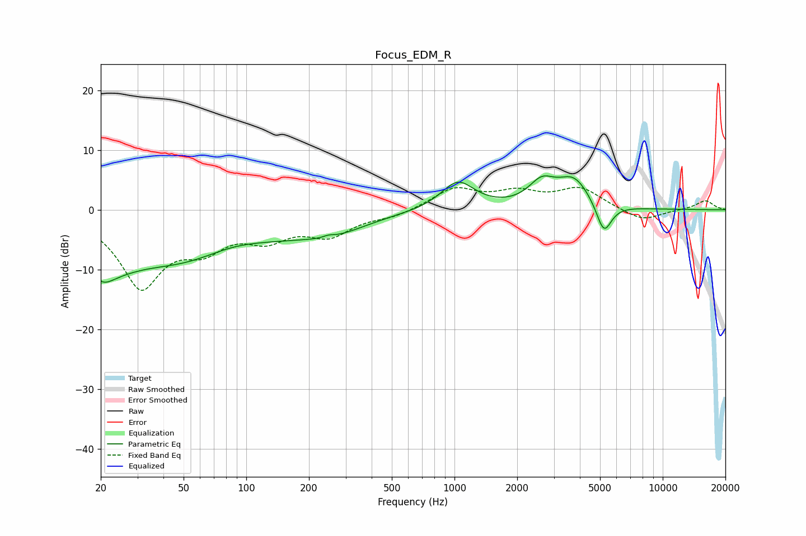

# Focus_EDM_R
See [usage instructions](https://github.com/jaakkopasanen/AutoEq#usage) for more options and info.

### Parametric EQs
Apply preamp of -5.8 dB when using parametric equalizer.

|   # | Type    |   Fc (Hz) |    Q |   Gain (dB) |
|-----|---------|-----------|------|-------------|
|   1 | Peaking |        20 | 2.41 |        -3.8 |
|   2 | Peaking |        23 | 1.08 |        -3.4 |
|   3 | Peaking |        56 | 0.36 |        -9.6 |
|   4 | Peaking |        84 | 0.8  |         2.9 |
|   5 | Peaking |       248 | 5.42 |         0.4 |
|   6 | Peaking |       262 | 0.87 |        -2.2 |
|   7 | Peaking |      1037 | 1.75 |         4.7 |
|   8 | Peaking |      2624 | 2.23 |         3.7 |
|   9 | Peaking |      3748 | 1.76 |         4.9 |
|  10 | Peaking |      5219 | 3.77 |        -5.3 |

### Fixed Band EQs
When using fixed band (also called graphic) equalizer, apply preamp of **-3.9 dB** (if available) and set gains manually with these parameters.

|   # | Type    |   Fc (Hz) |    Q |   Gain (dB) |
|-----|---------|-----------|------|-------------|
|   1 | Peaking |        31 | 1.41 |       -12.4 |
|   2 | Peaking |        62 | 1.41 |        -4.8 |
|   3 | Peaking |       125 | 1.41 |        -3.9 |
|   4 | Peaking |       250 | 1.41 |        -3.8 |
|   5 | Peaking |       500 | 1.41 |        -1   |
|   6 | Peaking |      1000 | 1.41 |         3.5 |
|   7 | Peaking |      2000 | 1.41 |         2.5 |
|   8 | Peaking |      4000 | 1.41 |         3.5 |
|   9 | Peaking |      8000 | 1.41 |        -2   |
|  10 | Peaking |     16000 | 1.41 |         1.6 |

### Graphs

