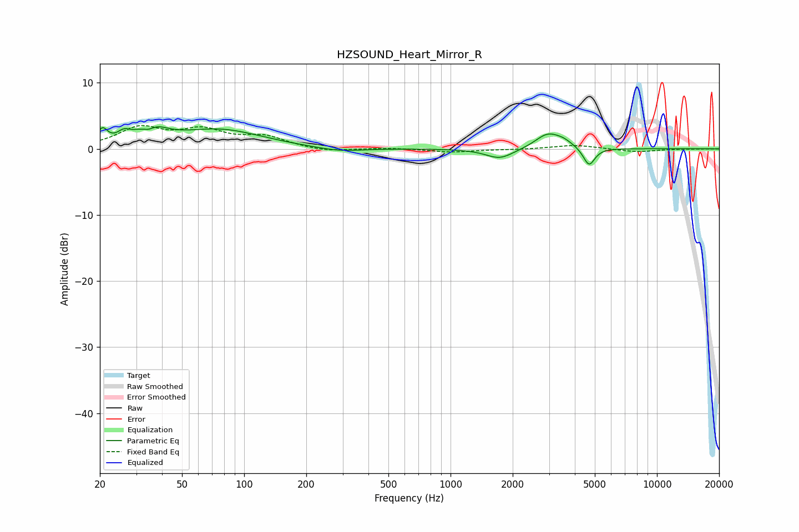

# HZSOUND_Heart_Mirror_R
See [usage instructions](https://github.com/jaakkopasanen/AutoEq#usage) for more options and info.

### Parametric EQs
Apply preamp of -3.4 dB when using parametric equalizer.

|   # | Type    |   Fc (Hz) |    Q |   Gain (dB) |
|-----|---------|-----------|------|-------------|
|   1 | Peaking |        21 | 5.93 |         2.2 |
|   2 | Peaking |        26 | 4.75 |         1.1 |
|   3 | Peaking |        34 | 4.17 |        -1.4 |
|   4 | Peaking |        35 | 2.11 |         3.1 |
|   5 | Peaking |        76 | 0.7  |         2.8 |
|   6 | Peaking |       288 | 1.27 |        -0.6 |
|   7 | Peaking |      1731 | 2.09 |        -1.6 |
|   8 | Peaking |      2951 | 2.35 |         2.2 |
|   9 | Peaking |      3536 | 3.01 |         0.8 |
|  10 | Peaking |      4688 | 5.05 |        -2.8 |

### Fixed Band EQs
When using fixed band (also called graphic) equalizer, apply preamp of **-3.6 dB** (if available) and set gains manually with these parameters.

|   # | Type    |   Fc (Hz) |    Q |   Gain (dB) |
|-----|---------|-----------|------|-------------|
|   1 | Peaking |        31 | 1.41 |         3   |
|   2 | Peaking |        62 | 1.41 |         2.5 |
|   3 | Peaking |       125 | 1.41 |         1.7 |
|   4 | Peaking |       250 | 1.41 |        -0.5 |
|   5 | Peaking |       500 | 1.41 |         0.1 |
|   6 | Peaking |      1000 | 1.41 |        -0.5 |
|   7 | Peaking |      2000 | 1.41 |        -0.1 |
|   8 | Peaking |      4000 | 1.41 |         0.6 |
|   9 | Peaking |      8000 | 1.41 |        -0.5 |
|  10 | Peaking |     16000 | 1.41 |        -0   |

### Graphs

