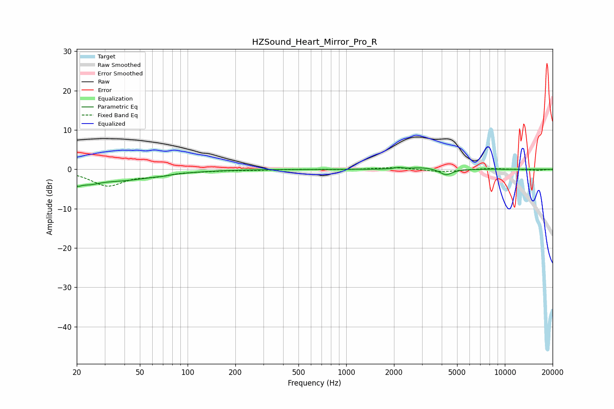

# HZSound_Heart_Mirror_Pro_R
See [usage instructions](https://github.com/jaakkopasanen/AutoEq#usage) for more options and info.

### Parametric EQs
Apply preamp of -0.6 dB when using parametric equalizer.

|   # | Type    |   Fc (Hz) |    Q |   Gain (dB) |
|-----|---------|-----------|------|-------------|
|   1 | Peaking |        20 | 5.27 |        -1.7 |
|   2 | Peaking |        24 | 2.21 |        -1.5 |
|   3 | Peaking |        37 | 0.6  |        -2.7 |
|   4 | Peaking |        70 | 5.99 |        -0.1 |
|   5 | Peaking |       465 | 6    |        -0   |
|   6 | Peaking |      2133 | 5.59 |         0.4 |
|   7 | Peaking |      3042 | 1.95 |         0.5 |
|   8 | Peaking |      4099 | 5.97 |        -0   |
|   9 | Peaking |      4262 | 3.74 |        -1.5 |
|  10 | Peaking |      8251 | 4.54 |         0.1 |

### Fixed Band EQs
When using fixed band (also called graphic) equalizer, apply preamp of **-0.5 dB** (if available) and set gains manually with these parameters.

|   # | Type    |   Fc (Hz) |    Q |   Gain (dB) |
|-----|---------|-----------|------|-------------|
|   1 | Peaking |        31 | 1.41 |        -4   |
|   2 | Peaking |        62 | 1.41 |        -1.2 |
|   3 | Peaking |       125 | 1.41 |        -0.3 |
|   4 | Peaking |       250 | 1.41 |        -0.2 |
|   5 | Peaking |       500 | 1.41 |         0   |
|   6 | Peaking |      1000 | 1.41 |        -0.1 |
|   7 | Peaking |      2000 | 1.41 |         0.5 |
|   8 | Peaking |      4000 | 1.41 |        -0.7 |
|   9 | Peaking |      8000 | 1.41 |         0.3 |
|  10 | Peaking |     16000 | 1.41 |        -0.3 |

### Graphs

