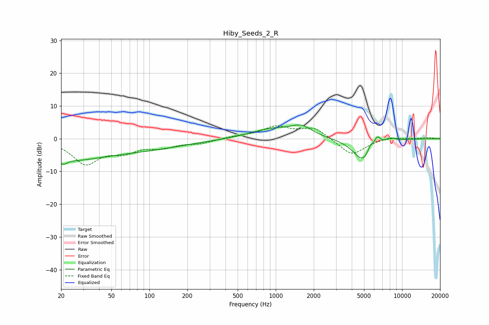

# Hiby_Seeds_2_R
See [usage instructions](https://github.com/jaakkopasanen/AutoEq#usage) for more options and info.

### Parametric EQs
Apply preamp of -4.3 dB when using parametric equalizer.

|   # | Type    |   Fc (Hz) |    Q |   Gain (dB) |
|-----|---------|-----------|------|-------------|
|   1 | Peaking |        21 | 4.85 |        -1.4 |
|   2 | Peaking |        23 | 0.6  |        -2.4 |
|   3 | Peaking |        34 | 0.18 |        -4.2 |
|   4 | Peaking |       942 | 0.82 |         2.9 |
|   5 | Peaking |      1605 | 1.72 |         2.9 |
|   6 | Peaking |      4879 | 1.81 |        -6.8 |
|   7 | Peaking |      5614 | 5.98 |         2   |
|   8 | Peaking |      6368 | 5.53 |         2.8 |
|   9 | Peaking |      8047 | 3.44 |         1   |
|  10 | Peaking |      8095 | 4.08 |         0.1 |

### Fixed Band EQs
When using fixed band (also called graphic) equalizer, apply preamp of **-4.0 dB** (if available) and set gains manually with these parameters.

|   # | Type    |   Fc (Hz) |    Q |   Gain (dB) |
|-----|---------|-----------|------|-------------|
|   1 | Peaking |        31 | 1.41 |        -7.3 |
|   2 | Peaking |        62 | 1.41 |        -3.3 |
|   3 | Peaking |       125 | 1.41 |        -2.2 |
|   4 | Peaking |       250 | 1.41 |        -1.3 |
|   5 | Peaking |       500 | 1.41 |         0.7 |
|   6 | Peaking |      1000 | 1.41 |         3.4 |
|   7 | Peaking |      2000 | 1.41 |         3.4 |
|   8 | Peaking |      4000 | 1.41 |        -5.2 |
|   9 | Peaking |      8000 | 1.41 |         0.6 |
|  10 | Peaking |     16000 | 1.41 |         0.3 |

### Graphs

