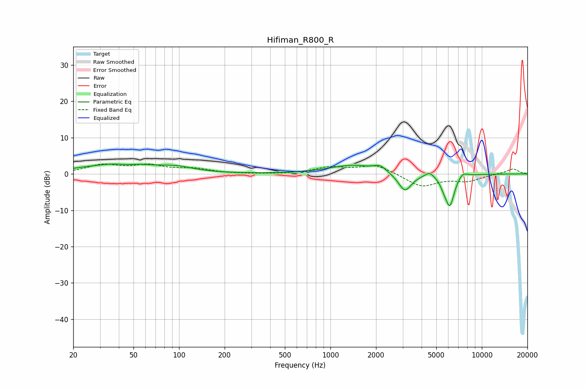

# Hifiman_R800_R
See [usage instructions](https://github.com/jaakkopasanen/AutoEq#usage) for more options and info.

### Parametric EQs
Apply preamp of -2.8 dB when using parametric equalizer.

|   # | Type    |   Fc (Hz) |    Q |   Gain (dB) |
|-----|---------|-----------|------|-------------|
|   1 | Peaking |        41 | 0.58 |         2.8 |
|   2 | Peaking |        45 | 3.19 |        -0.3 |
|   3 | Peaking |        98 | 1.38 |         1.1 |
|   4 | Peaking |      1401 | 0.92 |         2.4 |
|   5 | Peaking |      2128 | 3.6  |         1.5 |
|   6 | Peaking |      3104 | 3.19 |        -5.1 |
|   7 | Peaking |      4512 | 4.92 |         1.4 |
|   8 | Peaking |      5630 | 6    |        -1.5 |
|   9 | Peaking |      6151 | 4.59 |        -8.4 |
|  10 | Peaking |      7490 | 4.48 |         1.5 |

### Fixed Band EQs
When using fixed band (also called graphic) equalizer, apply preamp of **-2.8 dB** (if available) and set gains manually with these parameters.

|   # | Type    |   Fc (Hz) |    Q |   Gain (dB) |
|-----|---------|-----------|------|-------------|
|   1 | Peaking |        31 | 1.41 |         2.3 |
|   2 | Peaking |        62 | 1.41 |         2.1 |
|   3 | Peaking |       125 | 1.41 |         1.2 |
|   4 | Peaking |       250 | 1.41 |        -0   |
|   5 | Peaking |       500 | 1.41 |        -0.1 |
|   6 | Peaking |      1000 | 1.41 |         1.7 |
|   7 | Peaking |      2000 | 1.41 |         2.5 |
|   8 | Peaking |      4000 | 1.41 |        -3.5 |
|   9 | Peaking |      8000 | 1.41 |        -1.8 |
|  10 | Peaking |     16000 | 1.41 |         1.5 |

### Graphs

