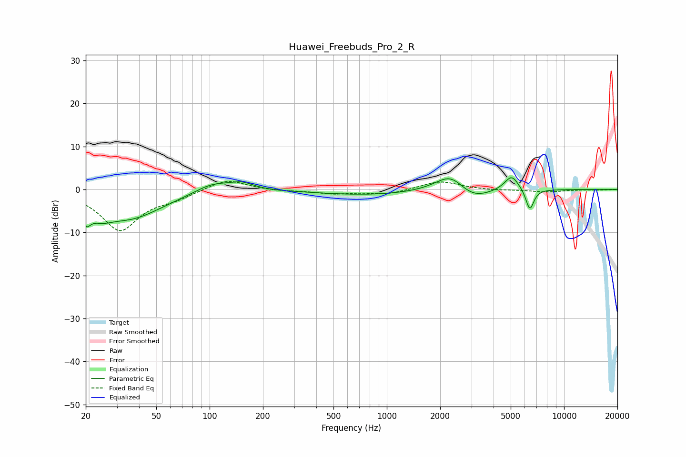

# Huawei_Freebuds_Pro_2_R
See [usage instructions](https://github.com/jaakkopasanen/AutoEq#usage) for more options and info.

### Parametric EQs
Apply preamp of -2.8 dB when using parametric equalizer.

|   # | Type    |   Fc (Hz) |    Q |   Gain (dB) |
|-----|---------|-----------|------|-------------|
|   1 | Peaking |        20 | 5.06 |        -3.8 |
|   2 | Peaking |        24 | 2.28 |        -2.3 |
|   3 | Peaking |        35 | 0.74 |        -6.5 |
|   4 | Peaking |       104 | 1.35 |         2.3 |
|   5 | Peaking |       153 | 2.18 |         1.5 |
|   6 | Peaking |       781 | 0.48 |        -1.2 |
|   7 | Peaking |      2310 | 1.59 |         4.8 |
|   8 | Peaking |      2979 | 1.42 |        -3.2 |
|   9 | Peaking |      5062 | 3.41 |         3.6 |
|  10 | Peaking |      6411 | 6    |        -5   |

### Fixed Band EQs
When using fixed band (also called graphic) equalizer, apply preamp of **-1.9 dB** (if available) and set gains manually with these parameters.

|   # | Type    |   Fc (Hz) |    Q |   Gain (dB) |
|-----|---------|-----------|------|-------------|
|   1 | Peaking |        31 | 1.41 |        -9.4 |
|   2 | Peaking |        62 | 1.41 |        -1.6 |
|   3 | Peaking |       125 | 1.41 |         2.6 |
|   4 | Peaking |       250 | 1.41 |        -0.3 |
|   5 | Peaking |       500 | 1.41 |        -0.9 |
|   6 | Peaking |      1000 | 1.41 |        -1.1 |
|   7 | Peaking |      2000 | 1.41 |         2   |
|   8 | Peaking |      4000 | 1.41 |        -0.2 |
|   9 | Peaking |      8000 | 1.41 |        -0.6 |
|  10 | Peaking |     16000 | 1.41 |        -0.1 |

### Graphs

