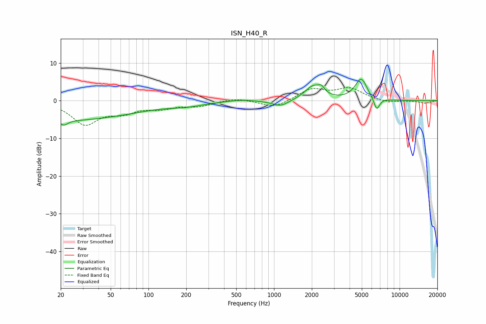

# ISN_H40_R
See [usage instructions](https://github.com/jaakkopasanen/AutoEq#usage) for more options and info.

### Parametric EQs
Apply preamp of -5.8 dB when using parametric equalizer.

|   # | Type    |   Fc (Hz) |    Q |   Gain (dB) |
|-----|---------|-----------|------|-------------|
|   1 | Peaking |        20 | 0.22 |        -5.2 |
|   2 | Peaking |        21 | 5.62 |        -4   |
|   3 | Peaking |        22 | 6    |         2.8 |
|   4 | Peaking |       203 | 1.06 |        -0.9 |
|   5 | Peaking |       545 | 1.49 |         0.4 |
|   6 | Peaking |      1126 | 2.12 |        -1.7 |
|   7 | Peaking |      2060 | 2.11 |         3.8 |
|   8 | Peaking |      2391 | 5.97 |         1.3 |
|   9 | Peaking |      4941 | 2.86 |         5.7 |
|  10 | Peaking |      6568 | 5.69 |        -3.4 |

### Fixed Band EQs
When using fixed band (also called graphic) equalizer, apply preamp of **-3.6 dB** (if available) and set gains manually with these parameters.

|   # | Type    |   Fc (Hz) |    Q |   Gain (dB) |
|-----|---------|-----------|------|-------------|
|   1 | Peaking |        31 | 1.41 |        -6   |
|   2 | Peaking |        62 | 1.41 |        -2.6 |
|   3 | Peaking |       125 | 1.41 |        -1.7 |
|   4 | Peaking |       250 | 1.41 |        -1.3 |
|   5 | Peaking |       500 | 1.41 |         0.8 |
|   6 | Peaking |      1000 | 1.41 |        -1.9 |
|   7 | Peaking |      2000 | 1.41 |         3   |
|   8 | Peaking |      4000 | 1.41 |         3.1 |
|   9 | Peaking |      8000 | 1.41 |        -0.6 |
|  10 | Peaking |     16000 | 1.41 |        -0.7 |

### Graphs

