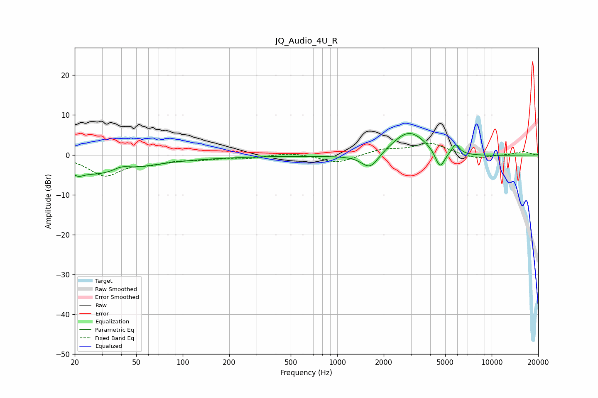

# JQ_Audio_4U_R
See [usage instructions](https://github.com/jaakkopasanen/AutoEq#usage) for more options and info.

### Parametric EQs
Apply preamp of -5.5 dB when using parametric equalizer.

|   # | Type    |   Fc (Hz) |    Q |   Gain (dB) |
|-----|---------|-----------|------|-------------|
|   1 | Peaking |        21 | 5.43 |        -4.3 |
|   2 | Peaking |        21 | 5.9  |         3.2 |
|   3 | Peaking |        29 | 0.59 |        -4.1 |
|   4 | Peaking |        40 | 2.61 |         1.3 |
|   5 | Peaking |        50 | 0.19 |        -0.8 |
|   6 | Peaking |      1634 | 2.51 |        -4   |
|   7 | Peaking |      2844 | 0.28 |        -0.9 |
|   8 | Peaking |      2918 | 1.2  |         6.9 |
|   9 | Peaking |      4624 | 4.45 |        -4.7 |
|  10 | Peaking |      5845 | 5.57 |         2.6 |

### Fixed Band EQs
When using fixed band (also called graphic) equalizer, apply preamp of **-3.0 dB** (if available) and set gains manually with these parameters.

|   # | Type    |   Fc (Hz) |    Q |   Gain (dB) |
|-----|---------|-----------|------|-------------|
|   1 | Peaking |        31 | 1.41 |        -5   |
|   2 | Peaking |        62 | 1.41 |        -1.6 |
|   3 | Peaking |       125 | 1.41 |        -0.9 |
|   4 | Peaking |       250 | 1.41 |        -0.8 |
|   5 | Peaking |       500 | 1.41 |         0.7 |
|   6 | Peaking |      1000 | 1.41 |        -2.1 |
|   7 | Peaking |      2000 | 1.41 |         1.4 |
|   8 | Peaking |      4000 | 1.41 |         2.9 |
|   9 | Peaking |      8000 | 1.41 |        -1.1 |
|  10 | Peaking |     16000 | 1.41 |         0.8 |

### Graphs

