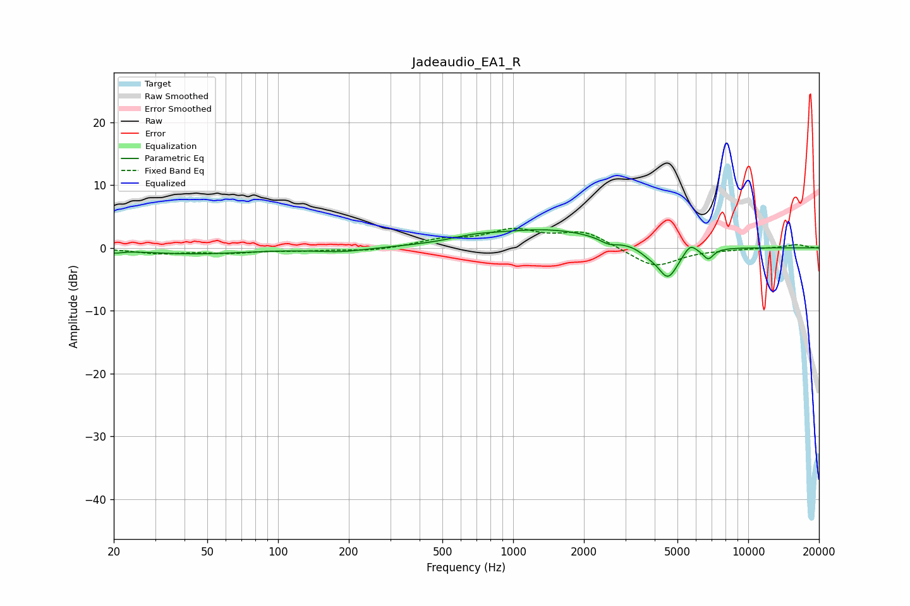

# Jadeaudio_EA1_R
See [usage instructions](https://github.com/jaakkopasanen/AutoEq#usage) for more options and info.

### Parametric EQs
Apply preamp of -3.0 dB when using parametric equalizer.

|   # | Type    |   Fc (Hz) |    Q |   Gain (dB) |
|-----|---------|-----------|------|-------------|
|   1 | Peaking |        20 | 5.79 |        -0.4 |
|   2 | Peaking |        44 | 0.59 |        -0.9 |
|   3 | Peaking |       187 | 1.33 |        -0.6 |
|   4 | Peaking |       680 | 1.39 |         0.7 |
|   5 | Peaking |      1400 | 0.58 |         2.8 |
|   6 | Peaking |      2552 | 3.82 |        -0.9 |
|   7 | Peaking |      3753 | 3.51 |        -0.8 |
|   8 | Peaking |      4554 | 3.16 |        -5.1 |
|   9 | Peaking |      5659 | 5.37 |         1.5 |
|  10 | Peaking |      6760 | 6    |        -1.7 |

### Fixed Band EQs
When using fixed band (also called graphic) equalizer, apply preamp of **-3.2 dB** (if available) and set gains manually with these parameters.

|   # | Type    |   Fc (Hz) |    Q |   Gain (dB) |
|-----|---------|-----------|------|-------------|
|   1 | Peaking |        31 | 1.41 |        -0.8 |
|   2 | Peaking |        62 | 1.41 |        -0.7 |
|   3 | Peaking |       125 | 1.41 |        -0.4 |
|   4 | Peaking |       250 | 1.41 |        -0.5 |
|   5 | Peaking |       500 | 1.41 |         1.2 |
|   6 | Peaking |      1000 | 1.41 |         2.6 |
|   7 | Peaking |      2000 | 1.41 |         2.5 |
|   8 | Peaking |      4000 | 1.41 |        -3.2 |
|   9 | Peaking |      8000 | 1.41 |        -0.2 |
|  10 | Peaking |     16000 | 1.41 |         0.6 |

### Graphs

