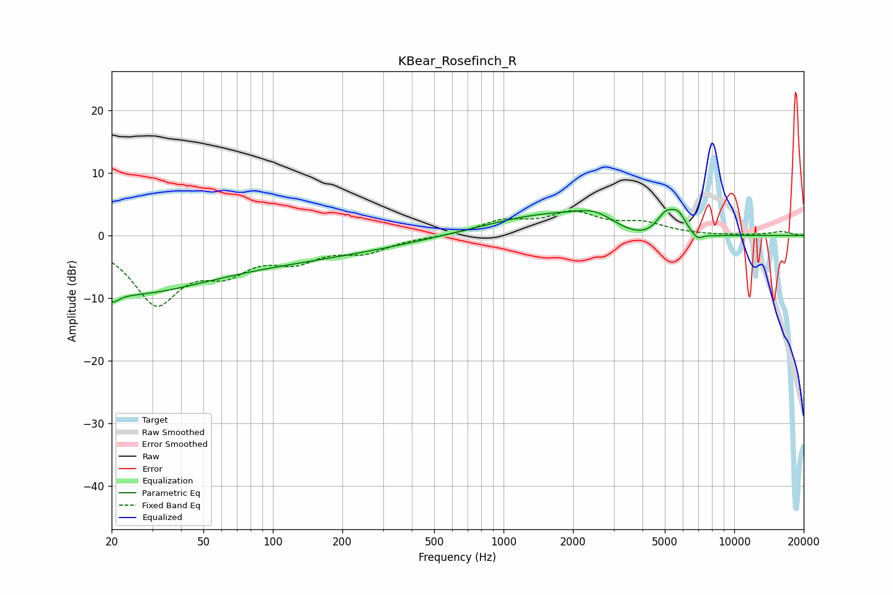

# KBear_Rosefinch_R
See [usage instructions](https://github.com/jaakkopasanen/AutoEq#usage) for more options and info.

### Parametric EQs
Apply preamp of -4.2 dB when using parametric equalizer.

|   # | Type    |   Fc (Hz) |    Q |   Gain (dB) |
|-----|---------|-----------|------|-------------|
|   1 | Peaking |        20 | 0.4  |        -6.1 |
|   2 | Peaking |        20 | 5.36 |        -1.4 |
|   3 | Peaking |        62 | 0.18 |        -3.9 |
|   4 | Peaking |      1600 | 0.53 |         3.5 |
|   5 | Peaking |      2511 | 1.59 |         2.1 |
|   6 | Peaking |      4063 | 0.93 |        -2.4 |
|   7 | Peaking |      5041 | 3.29 |         3.6 |
|   8 | Peaking |      5736 | 4.17 |         2.7 |
|   9 | Peaking |      6916 | 5.58 |        -1.1 |
|  10 | Peaking |      8373 | 5.95 |        -0.1 |

### Fixed Band EQs
When using fixed band (also called graphic) equalizer, apply preamp of **-4.0 dB** (if available) and set gains manually with these parameters.

|   # | Type    |   Fc (Hz) |    Q |   Gain (dB) |
|-----|---------|-----------|------|-------------|
|   1 | Peaking |        31 | 1.41 |       -10.3 |
|   2 | Peaking |        62 | 1.41 |        -4.4 |
|   3 | Peaking |       125 | 1.41 |        -3.3 |
|   4 | Peaking |       250 | 1.41 |        -2.3 |
|   5 | Peaking |       500 | 1.41 |        -0.1 |
|   6 | Peaking |      1000 | 1.41 |         2.1 |
|   7 | Peaking |      2000 | 1.41 |         3.3 |
|   8 | Peaking |      4000 | 1.41 |         1.7 |
|   9 | Peaking |      8000 | 1.41 |        -0   |
|  10 | Peaking |     16000 | 1.41 |         0.6 |

### Graphs

