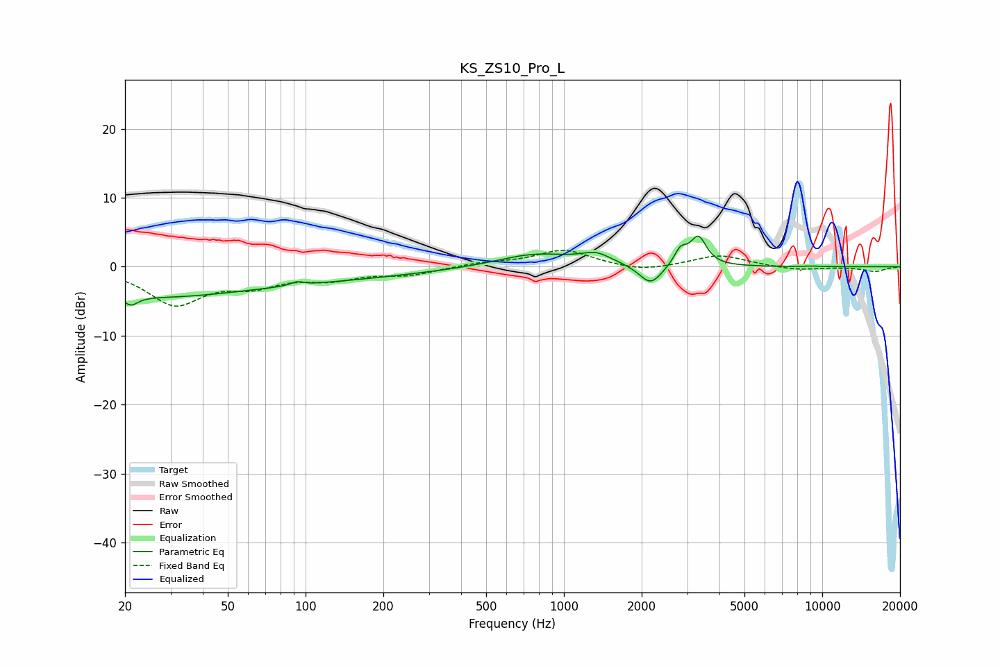

# KS_ZS10_Pro_L
See [usage instructions](https://github.com/jaakkopasanen/AutoEq#usage) for more options and info.

### Parametric EQs
Apply preamp of -4.6 dB when using parametric equalizer.

|   # | Type    |   Fc (Hz) |    Q |   Gain (dB) |
|-----|---------|-----------|------|-------------|
|   1 | Peaking |        21 | 5.21 |        -1.4 |
|   2 | Peaking |        22 | 0.41 |        -3.1 |
|   3 | Peaking |        76 | 0.26 |        -1.9 |
|   4 | Peaking |        93 | 5.94 |         0.5 |
|   5 | Peaking |       771 | 0.97 |         1.9 |
|   6 | Peaking |      1333 | 2.39 |         1.5 |
|   7 | Peaking |      2167 | 3.23 |        -3   |
|   8 | Peaking |      2828 | 5.73 |         2.2 |
|   9 | Peaking |      3315 | 4.6  |         4.1 |
|  10 | Peaking |      9100 | 5.9  |         0.1 |

### Fixed Band EQs
When using fixed band (also called graphic) equalizer, apply preamp of **-2.5 dB** (if available) and set gains manually with these parameters.

|   # | Type    |   Fc (Hz) |    Q |   Gain (dB) |
|-----|---------|-----------|------|-------------|
|   1 | Peaking |        31 | 1.41 |        -5.2 |
|   2 | Peaking |        62 | 1.41 |        -2.2 |
|   3 | Peaking |       125 | 1.41 |        -1.5 |
|   4 | Peaking |       250 | 1.41 |        -1.1 |
|   5 | Peaking |       500 | 1.41 |         0.5 |
|   6 | Peaking |      1000 | 1.41 |         2.4 |
|   7 | Peaking |      2000 | 1.41 |        -0.8 |
|   8 | Peaking |      4000 | 1.41 |         1.7 |
|   9 | Peaking |      8000 | 1.41 |        -0.5 |
|  10 | Peaking |     16000 | 1.41 |        -0.7 |

### Graphs

