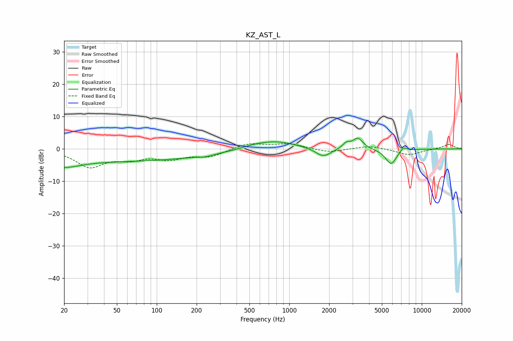

# KZ_AST_L
See [usage instructions](https://github.com/jaakkopasanen/AutoEq#usage) for more options and info.

### Parametric EQs
Apply preamp of -3.4 dB when using parametric equalizer.

|   # | Type    |   Fc (Hz) |    Q |   Gain (dB) |
|-----|---------|-----------|------|-------------|
|   1 | Peaking |        20 | 1.21 |        -2.5 |
|   2 | Peaking |        51 | 0.18 |        -3.7 |
|   3 | Peaking |       234 | 3.12 |        -0.5 |
|   4 | Peaking |       544 | 1.32 |         0.9 |
|   5 | Peaking |       809 | 0.96 |         2.3 |
|   6 | Peaking |      1807 | 2.47 |        -2.8 |
|   7 | Peaking |      2692 | 5.33 |         1.6 |
|   8 | Peaking |      3292 | 3.62 |         3.4 |
|   9 | Peaking |      5869 | 3.21 |        -4.8 |
|  10 | Peaking |      7256 | 4.91 |         1.5 |

### Fixed Band EQs
When using fixed band (also called graphic) equalizer, apply preamp of **-1.7 dB** (if available) and set gains manually with these parameters.

|   # | Type    |   Fc (Hz) |    Q |   Gain (dB) |
|-----|---------|-----------|------|-------------|
|   1 | Peaking |        31 | 1.41 |        -5.3 |
|   2 | Peaking |        62 | 1.41 |        -2.5 |
|   3 | Peaking |       125 | 1.41 |        -2.7 |
|   4 | Peaking |       250 | 1.41 |        -2.2 |
|   5 | Peaking |       500 | 1.41 |         1.8 |
|   6 | Peaking |      1000 | 1.41 |         1.5 |
|   7 | Peaking |      2000 | 1.41 |        -1.2 |
|   8 | Peaking |      4000 | 1.41 |         1   |
|   9 | Peaking |      8000 | 1.41 |        -1.9 |
|  10 | Peaking |     16000 | 1.41 |         1.5 |

### Graphs

