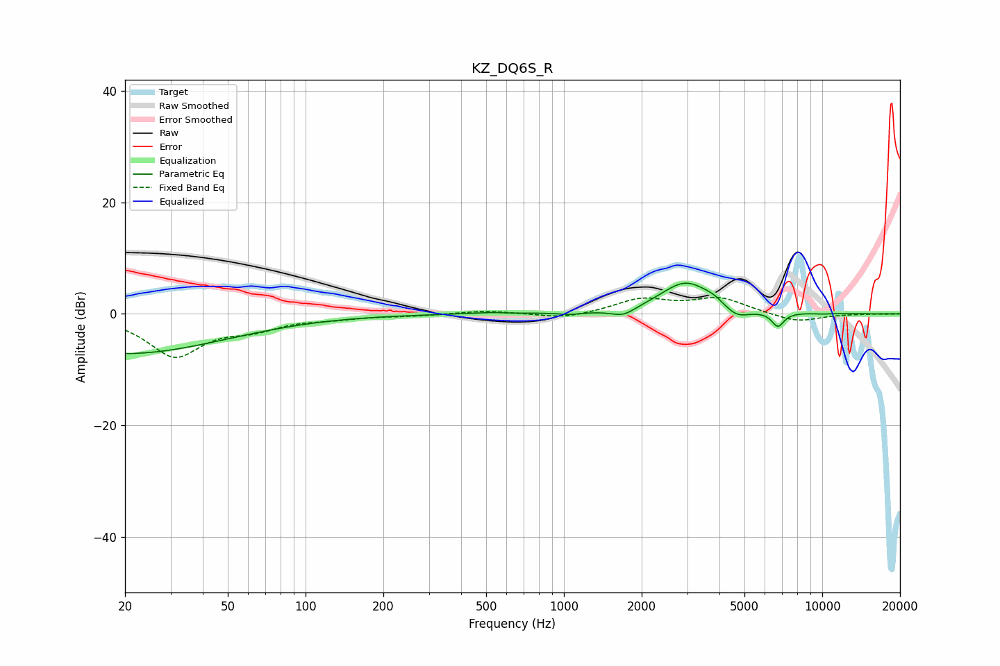

# KZ_DQ6S_R
See [usage instructions](https://github.com/jaakkopasanen/AutoEq#usage) for more options and info.

### Parametric EQs
Apply preamp of -5.6 dB when using parametric equalizer.

|   # | Type    |   Fc (Hz) |    Q |   Gain (dB) |
|-----|---------|-----------|------|-------------|
|   1 | Peaking |        20 | 0.36 |        -7.1 |
|   2 | Peaking |       542 | 1.74 |         0.3 |
|   3 | Peaking |       620 | 4.1  |        -0.1 |
|   4 | Peaking |      1059 | 3.04 |        -0.4 |
|   5 | Peaking |      1699 | 2.98 |        -1.5 |
|   6 | Peaking |      2963 | 1.42 |         5.7 |
|   7 | Peaking |      3809 | 3.59 |         0.7 |
|   8 | Peaking |      4654 | 2.75 |        -2   |
|   9 | Peaking |      6738 | 5.77 |        -2.6 |
|  10 | Peaking |     10000 | 4.63 |        -0.1 |

### Fixed Band EQs
When using fixed band (also called graphic) equalizer, apply preamp of **-3.0 dB** (if available) and set gains manually with these parameters.

|   # | Type    |   Fc (Hz) |    Q |   Gain (dB) |
|-----|---------|-----------|------|-------------|
|   1 | Peaking |        31 | 1.41 |        -7.4 |
|   2 | Peaking |        62 | 1.41 |        -2.1 |
|   3 | Peaking |       125 | 1.41 |        -0.6 |
|   4 | Peaking |       250 | 1.41 |        -0.3 |
|   5 | Peaking |       500 | 1.41 |         0.6 |
|   6 | Peaking |      1000 | 1.41 |        -0.9 |
|   7 | Peaking |      2000 | 1.41 |         2.5 |
|   8 | Peaking |      4000 | 1.41 |         2.7 |
|   9 | Peaking |      8000 | 1.41 |        -1.5 |
|  10 | Peaking |     16000 | 1.41 |         0   |

### Graphs

