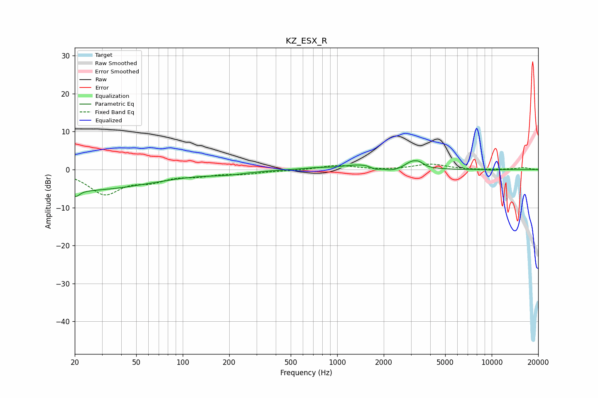

# KZ_ESX_R
See [usage instructions](https://github.com/jaakkopasanen/AutoEq#usage) for more options and info.

### Parametric EQs
Apply preamp of -2.4 dB when using parametric equalizer.

|   # | Type    |   Fc (Hz) |    Q |   Gain (dB) |
|-----|---------|-----------|------|-------------|
|   1 | Peaking |        20 | 5.86 |        -1.6 |
|   2 | Peaking |        21 | 0.28 |        -5.5 |
|   3 | Peaking |       196 | 1.08 |        -0.8 |
|   4 | Peaking |       709 | 1.65 |         0.3 |
|   5 | Peaking |      1463 | 1.17 |         1.4 |
|   6 | Peaking |      1759 | 5.18 |        -0.7 |
|   7 | Peaking |      2245 | 2.28 |        -1   |
|   8 | Peaking |      3053 | 3.1  |         1.9 |
|   9 | Peaking |      3411 | 5.21 |         0.8 |
|  10 | Peaking |     10000 | 5.21 |        -0.2 |

### Fixed Band EQs
When using fixed band (also called graphic) equalizer, apply preamp of **-1.5 dB** (if available) and set gains manually with these parameters.

|   # | Type    |   Fc (Hz) |    Q |   Gain (dB) |
|-----|---------|-----------|------|-------------|
|   1 | Peaking |        31 | 1.41 |        -6.2 |
|   2 | Peaking |        62 | 1.41 |        -2.4 |
|   3 | Peaking |       125 | 1.41 |        -1.3 |
|   4 | Peaking |       250 | 1.41 |        -1   |
|   5 | Peaking |       500 | 1.41 |        -0.2 |
|   6 | Peaking |      1000 | 1.41 |         1.1 |
|   7 | Peaking |      2000 | 1.41 |        -0.1 |
|   8 | Peaking |      4000 | 1.41 |         1.4 |
|   9 | Peaking |      8000 | 1.41 |        -0.1 |
|  10 | Peaking |     16000 | 1.41 |         0.5 |

### Graphs

