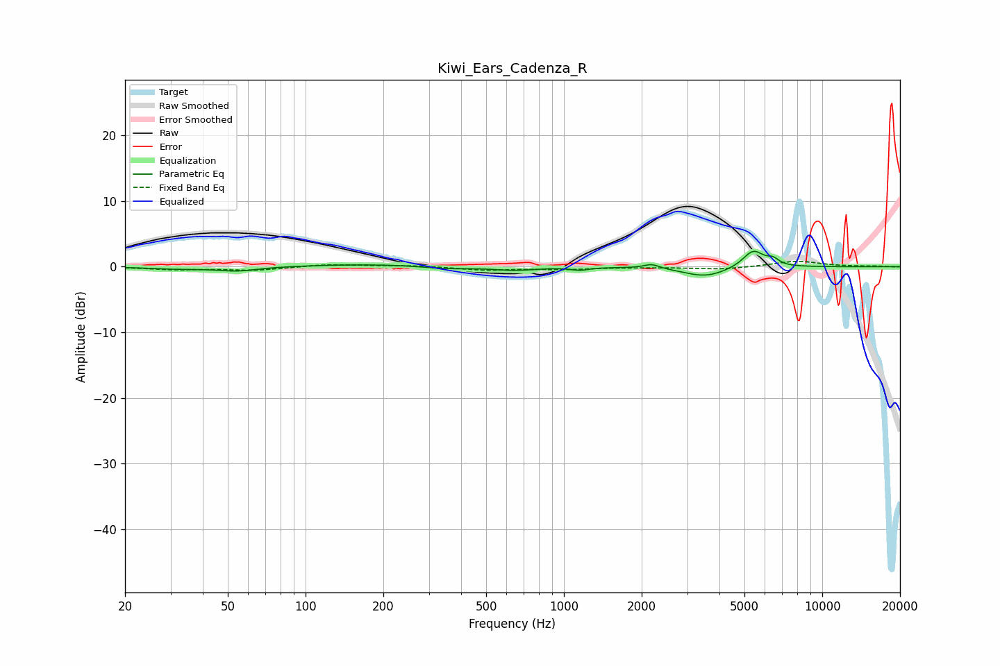

# Kiwi_Ears_Cadenza_R
See [usage instructions](https://github.com/jaakkopasanen/AutoEq#usage) for more options and info.

### Parametric EQs
Apply preamp of -2.4 dB when using parametric equalizer.

|   # | Type    |   Fc (Hz) |    Q |   Gain (dB) |
|-----|---------|-----------|------|-------------|
|   1 | Peaking |        31 | 1.43 |        -0.3 |
|   2 | Peaking |        54 | 1.72 |        -0.7 |
|   3 | Peaking |       189 | 0.54 |         0.4 |
|   4 | Peaking |       349 | 1.45 |        -0.4 |
|   5 | Peaking |       642 | 1.72 |        -0.5 |
|   6 | Peaking |      1153 | 4.28 |        -0.4 |
|   7 | Peaking |      2185 | 4.63 |         0.7 |
|   8 | Peaking |      3533 | 1.66 |        -1.5 |
|   9 | Peaking |      5407 | 3.43 |         2.6 |
|  10 | Peaking |      6445 | 5.95 |         0.9 |

### Fixed Band EQs
When using fixed band (also called graphic) equalizer, apply preamp of **-0.9 dB** (if available) and set gains manually with these parameters.

|   # | Type    |   Fc (Hz) |    Q |   Gain (dB) |
|-----|---------|-----------|------|-------------|
|   1 | Peaking |        31 | 1.41 |        -0.4 |
|   2 | Peaking |        62 | 1.41 |        -0.5 |
|   3 | Peaking |       125 | 1.41 |         0.4 |
|   4 | Peaking |       250 | 1.41 |         0.2 |
|   5 | Peaking |       500 | 1.41 |        -0.5 |
|   6 | Peaking |      1000 | 1.41 |        -0.4 |
|   7 | Peaking |      2000 | 1.41 |        -0.1 |
|   8 | Peaking |      4000 | 1.41 |        -0.4 |
|   9 | Peaking |      8000 | 1.41 |         0.9 |
|  10 | Peaking |     16000 | 1.41 |         0.1 |

### Graphs

