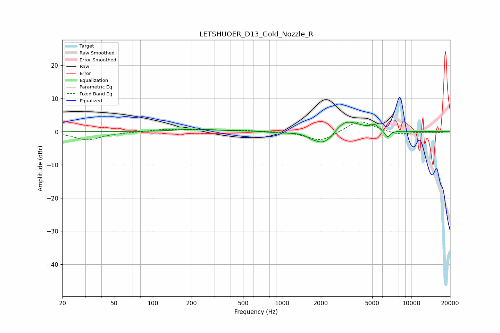

# LETSHUOER_D13_Gold_Nozzle_R
See [usage instructions](https://github.com/jaakkopasanen/AutoEq#usage) for more options and info.

### Parametric EQs
Apply preamp of -3.0 dB when using parametric equalizer.

|   # | Type    |   Fc (Hz) |    Q |   Gain (dB) |
|-----|---------|-----------|------|-------------|
|   1 | Peaking |       215 | 0.99 |         0.7 |
|   2 | Peaking |       496 | 1.33 |         0.1 |
|   3 | Peaking |       940 | 2.42 |        -0.3 |
|   4 | Peaking |      1683 | 4.78 |        -0.5 |
|   5 | Peaking |      2052 | 2.03 |        -3.9 |
|   6 | Peaking |      2373 | 5.28 |        -0.6 |
|   7 | Peaking |      3007 | 2.95 |         1   |
|   8 | Peaking |      3333 | 1.37 |         2.9 |
|   9 | Peaking |      5221 | 4.59 |         1.5 |
|  10 | Peaking |      6573 | 5.99 |        -2.2 |

### Fixed Band EQs
When using fixed band (also called graphic) equalizer, apply preamp of **-3.0 dB** (if available) and set gains manually with these parameters.

|   # | Type    |   Fc (Hz) |    Q |   Gain (dB) |
|-----|---------|-----------|------|-------------|
|   1 | Peaking |        31 | 1.41 |        -2.5 |
|   2 | Peaking |        62 | 1.41 |        -0.1 |
|   3 | Peaking |       125 | 1.41 |         0.7 |
|   4 | Peaking |       250 | 1.41 |         0.5 |
|   5 | Peaking |       500 | 1.41 |         0.3 |
|   6 | Peaking |      1000 | 1.41 |         0.1 |
|   7 | Peaking |      2000 | 1.41 |        -3   |
|   8 | Peaking |      4000 | 1.41 |         3.6 |
|   9 | Peaking |      8000 | 1.41 |        -1   |
|  10 | Peaking |     16000 | 1.41 |        -0.3 |

### Graphs

