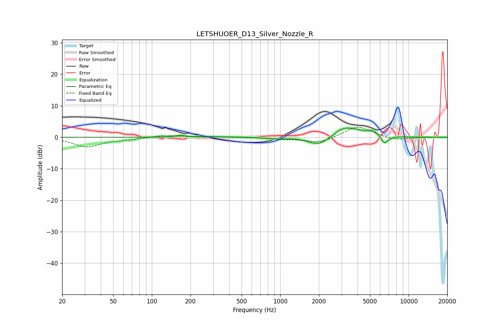

# LETSHUOER_D13_Silver_Nozzle_R
See [usage instructions](https://github.com/jaakkopasanen/AutoEq#usage) for more options and info.

### Parametric EQs
Apply preamp of -3.0 dB when using parametric equalizer.

|   # | Type    |   Fc (Hz) |    Q |   Gain (dB) |
|-----|---------|-----------|------|-------------|
|   1 | Peaking |       167 | 4    |         0.6 |
|   2 | Peaking |       311 | 1.49 |         0.2 |
|   3 | Peaking |       909 | 1.95 |        -0.4 |
|   4 | Peaking |      1983 | 1.82 |        -2.7 |
|   5 | Peaking |      2980 | 3.1  |         0.7 |
|   6 | Peaking |      3405 | 1.43 |         2.9 |
|   7 | Peaking |      4565 | 2.4  |         0.2 |
|   8 | Peaking |      5269 | 4.03 |         1.3 |
|   9 | Peaking |      6448 | 6    |        -2.1 |
|  10 | Peaking |      6837 | 4.42 |        -0.6 |

### Fixed Band EQs
When using fixed band (also called graphic) equalizer, apply preamp of **-3.3 dB** (if available) and set gains manually with these parameters.

|   # | Type    |   Fc (Hz) |    Q |   Gain (dB) |
|-----|---------|-----------|------|-------------|
|   1 | Peaking |        31 | 1.41 |        -3   |
|   2 | Peaking |        62 | 1.41 |        -0.6 |
|   3 | Peaking |       125 | 1.41 |         0.6 |
|   4 | Peaking |       250 | 1.41 |         0.2 |
|   5 | Peaking |       500 | 1.41 |         0.1 |
|   6 | Peaking |      1000 | 1.41 |        -0.5 |
|   7 | Peaking |      2000 | 1.41 |        -1.8 |
|   8 | Peaking |      4000 | 1.41 |         3.6 |
|   9 | Peaking |      8000 | 1.41 |        -1   |
|  10 | Peaking |     16000 | 1.41 |         0   |

### Graphs

