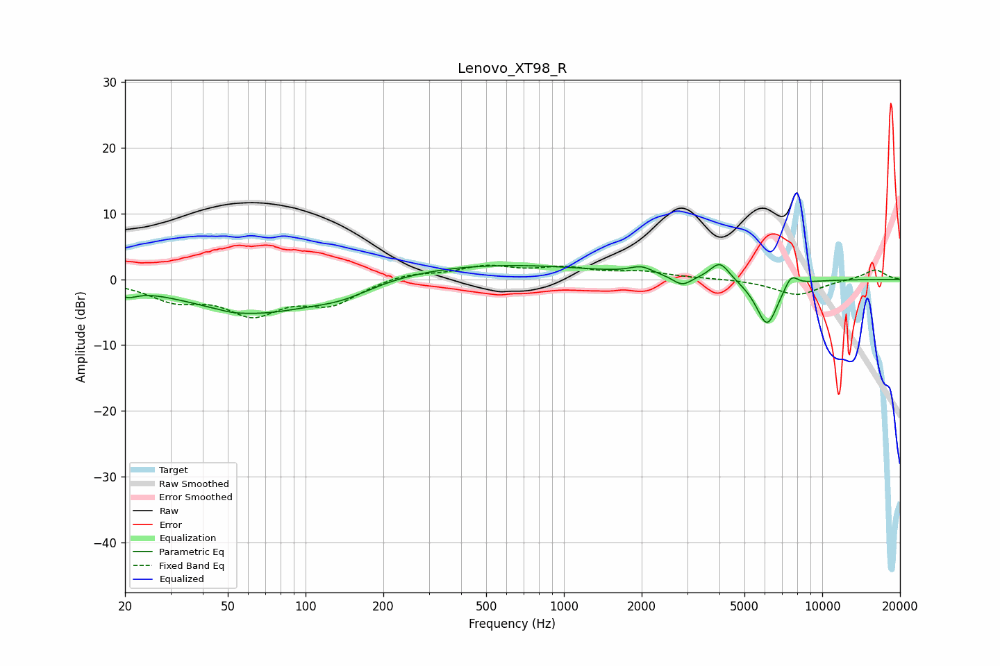

# Lenovo_XT98_R
See [usage instructions](https://github.com/jaakkopasanen/AutoEq#usage) for more options and info.

### Parametric EQs
Apply preamp of -2.3 dB when using parametric equalizer.

|   # | Type    |   Fc (Hz) |    Q |   Gain (dB) |
|-----|---------|-----------|------|-------------|
|   1 | Peaking |        20 | 3.69 |        -1.3 |
|   2 | Peaking |        52 | 3.61 |        -0.2 |
|   3 | Peaking |        63 | 0.56 |        -5.1 |
|   4 | Peaking |       139 | 1.16 |        -1.7 |
|   5 | Peaking |       499 | 0.32 |         2.4 |
|   6 | Peaking |      1993 | 3.21 |         1.1 |
|   7 | Peaking |      2871 | 3.87 |        -1.5 |
|   8 | Peaking |      4018 | 3.71 |         2.8 |
|   9 | Peaking |      6115 | 3.13 |        -7.1 |
|  10 | Peaking |      7576 | 5.06 |         2   |

### Fixed Band EQs
When using fixed band (also called graphic) equalizer, apply preamp of **-2.2 dB** (if available) and set gains manually with these parameters.

|   # | Type    |   Fc (Hz) |    Q |   Gain (dB) |
|-----|---------|-----------|------|-------------|
|   1 | Peaking |        31 | 1.41 |        -2.8 |
|   2 | Peaking |        62 | 1.41 |        -4.8 |
|   3 | Peaking |       125 | 1.41 |        -3.4 |
|   4 | Peaking |       250 | 1.41 |         1   |
|   5 | Peaking |       500 | 1.41 |         1.8 |
|   6 | Peaking |      1000 | 1.41 |         1.5 |
|   7 | Peaking |      2000 | 1.41 |         1   |
|   8 | Peaking |      4000 | 1.41 |         0.1 |
|   9 | Peaking |      8000 | 1.41 |        -2.4 |
|  10 | Peaking |     16000 | 1.41 |         1.5 |

### Graphs

