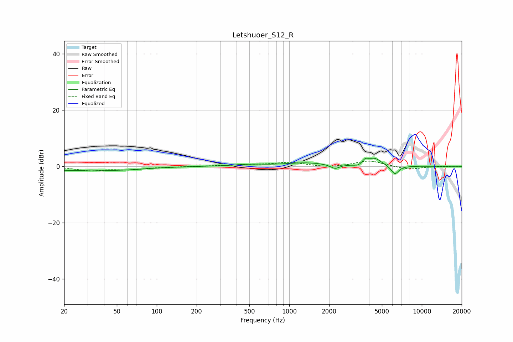

# Letshuoer_S12_R
See [usage instructions](https://github.com/jaakkopasanen/AutoEq#usage) for more options and info.

### Parametric EQs
Apply preamp of -3.0 dB when using parametric equalizer.

|   # | Type    |   Fc (Hz) |    Q |   Gain (dB) |
|-----|---------|-----------|------|-------------|
|   1 | Peaking |        20 | 2.71 |        -0.7 |
|   2 | Peaking |        26 | 3.48 |        -0.3 |
|   3 | Peaking |        46 | 0.64 |        -1.4 |
|   4 | Peaking |       499 | 1.2  |         0.6 |
|   5 | Peaking |      1345 | 0.93 |         1.2 |
|   6 | Peaking |      2213 | 4.31 |        -1.5 |
|   7 | Peaking |      3321 | 5.08 |        -0.7 |
|   8 | Peaking |      3744 | 6    |         1.6 |
|   9 | Peaking |      4412 | 2.74 |         2.7 |
|  10 | Peaking |      6265 | 4.69 |        -3.1 |

### Fixed Band EQs
When using fixed band (also called graphic) equalizer, apply preamp of **-1.9 dB** (if available) and set gains manually with these parameters.

|   # | Type    |   Fc (Hz) |    Q |   Gain (dB) |
|-----|---------|-----------|------|-------------|
|   1 | Peaking |        31 | 1.41 |        -1.5 |
|   2 | Peaking |        62 | 1.41 |        -1   |
|   3 | Peaking |       125 | 1.41 |        -0.2 |
|   4 | Peaking |       250 | 1.41 |         0.1 |
|   5 | Peaking |       500 | 1.41 |         0.5 |
|   6 | Peaking |      1000 | 1.41 |         1.4 |
|   7 | Peaking |      2000 | 1.41 |        -0.5 |
|   8 | Peaking |      4000 | 1.41 |         2.1 |
|   9 | Peaking |      8000 | 1.41 |        -1.2 |
|  10 | Peaking |     16000 | 1.41 |         0   |

### Graphs

