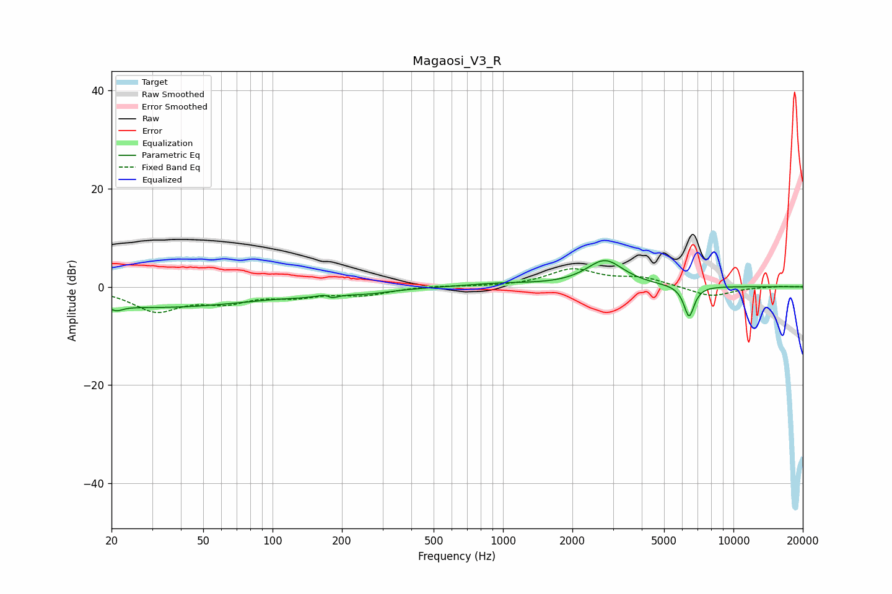

# Magaosi_V3_R
See [usage instructions](https://github.com/jaakkopasanen/AutoEq#usage) for more options and info.

### Parametric EQs
Apply preamp of -5.4 dB when using parametric equalizer.

|   # | Type    |   Fc (Hz) |    Q |   Gain (dB) |
|-----|---------|-----------|------|-------------|
|   1 | Peaking |        21 | 5.8  |        -3.8 |
|   2 | Peaking |        21 | 6    |         2.8 |
|   3 | Peaking |        31 | 0.3  |        -4.1 |
|   4 | Peaking |       133 | 1.85 |        -0.4 |
|   5 | Peaking |       173 | 5.5  |         1.6 |
|   6 | Peaking |       177 | 5.15 |        -1.9 |
|   7 | Peaking |       258 | 1.27 |        -0.9 |
|   8 | Peaking |       990 | 0.99 |         0.6 |
|   9 | Peaking |      2769 | 1.74 |         5.3 |
|  10 | Peaking |      6419 | 6    |        -6.4 |

### Fixed Band EQs
When using fixed band (also called graphic) equalizer, apply preamp of **-3.8 dB** (if available) and set gains manually with these parameters.

|   # | Type    |   Fc (Hz) |    Q |   Gain (dB) |
|-----|---------|-----------|------|-------------|
|   1 | Peaking |        31 | 1.41 |        -4.7 |
|   2 | Peaking |        62 | 1.41 |        -2.6 |
|   3 | Peaking |       125 | 1.41 |        -1.6 |
|   4 | Peaking |       250 | 1.41 |        -1.5 |
|   5 | Peaking |       500 | 1.41 |         0.2 |
|   6 | Peaking |      1000 | 1.41 |        -0   |
|   7 | Peaking |      2000 | 1.41 |         3.5 |
|   8 | Peaking |      4000 | 1.41 |         1.7 |
|   9 | Peaking |      8000 | 1.41 |        -2.1 |
|  10 | Peaking |     16000 | 1.41 |         0.1 |

### Graphs

