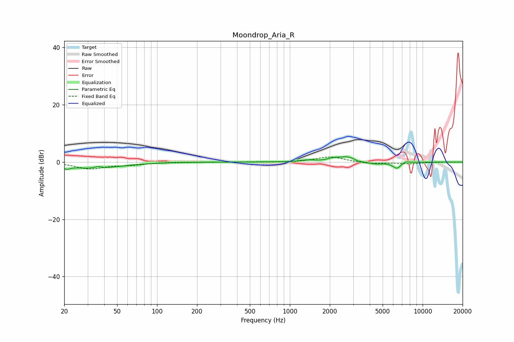

# Moondrop_Aria_R
See [usage instructions](https://github.com/jaakkopasanen/AutoEq#usage) for more options and info.

### Parametric EQs
Apply preamp of -1.9 dB when using parametric equalizer.

|   # | Type    |   Fc (Hz) |    Q |   Gain (dB) |
|-----|---------|-----------|------|-------------|
|   1 | Peaking |        21 | 5.56 |        -1.1 |
|   2 | Peaking |        33 | 0.74 |        -2.2 |
|   3 | Peaking |        36 | 5.96 |         0.7 |
|   4 | Peaking |      1354 | 2.67 |         0.6 |
|   5 | Peaking |      2123 | 3.45 |         0.8 |
|   6 | Peaking |      2757 | 2.02 |         1.9 |
|   7 | Peaking |      3230 | 4.97 |        -0.6 |
|   8 | Peaking |      4287 | 1.87 |        -0.9 |
|   9 | Peaking |      6394 | 4.62 |        -2.1 |
|  10 | Peaking |      7469 | 5.81 |         0.6 |

### Fixed Band EQs
When using fixed band (also called graphic) equalizer, apply preamp of **-1.9 dB** (if available) and set gains manually with these parameters.

|   # | Type    |   Fc (Hz) |    Q |   Gain (dB) |
|-----|---------|-----------|------|-------------|
|   1 | Peaking |        31 | 1.41 |        -2.3 |
|   2 | Peaking |        62 | 1.41 |        -0.9 |
|   3 | Peaking |       125 | 1.41 |         0.1 |
|   4 | Peaking |       250 | 1.41 |         0   |
|   5 | Peaking |       500 | 1.41 |         0   |
|   6 | Peaking |      1000 | 1.41 |        -0.2 |
|   7 | Peaking |      2000 | 1.41 |         1.9 |
|   8 | Peaking |      4000 | 1.41 |        -0.6 |
|   9 | Peaking |      8000 | 1.41 |        -0.6 |
|  10 | Peaking |     16000 | 1.41 |         0   |

### Graphs

