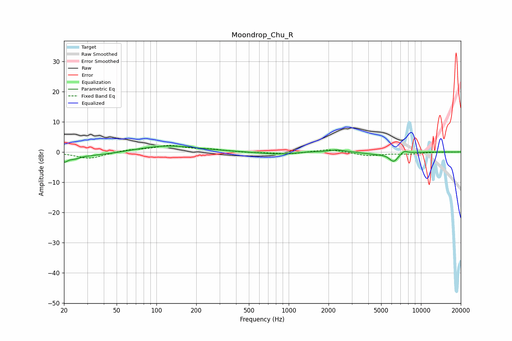

# Moondrop_Chu_R
See [usage instructions](https://github.com/jaakkopasanen/AutoEq#usage) for more options and info.

### Parametric EQs
Apply preamp of -2.0 dB when using parametric equalizer.

|   # | Type    |   Fc (Hz) |    Q |   Gain (dB) |
|-----|---------|-----------|------|-------------|
|   1 | Peaking |        20 | 5.82 |        -2   |
|   2 | Peaking |        24 | 3.44 |        -1   |
|   3 | Peaking |        30 | 0.59 |        -1.4 |
|   4 | Peaking |       118 | 0.61 |         2.2 |
|   5 | Peaking |       838 | 0.95 |        -0.8 |
|   6 | Peaking |      1358 | 2.29 |         0.2 |
|   7 | Peaking |      2311 | 2.23 |         0.8 |
|   8 | Peaking |      4554 | 1.61 |        -0.6 |
|   9 | Peaking |      6219 | 3.94 |        -3   |
|  10 | Peaking |      7443 | 5.31 |         1   |

### Fixed Band EQs
When using fixed band (also called graphic) equalizer, apply preamp of **-2.3 dB** (if available) and set gains manually with these parameters.

|   # | Type    |   Fc (Hz) |    Q |   Gain (dB) |
|-----|---------|-----------|------|-------------|
|   1 | Peaking |        31 | 1.41 |        -2.2 |
|   2 | Peaking |        62 | 1.41 |         0.7 |
|   3 | Peaking |       125 | 1.41 |         2   |
|   4 | Peaking |       250 | 1.41 |         0.8 |
|   5 | Peaking |       500 | 1.41 |        -0.2 |
|   6 | Peaking |      1000 | 1.41 |        -0.7 |
|   7 | Peaking |      2000 | 1.41 |         1   |
|   8 | Peaking |      4000 | 1.41 |        -1.3 |
|   9 | Peaking |      8000 | 1.41 |        -0.6 |
|  10 | Peaking |     16000 | 1.41 |        -0   |

### Graphs

