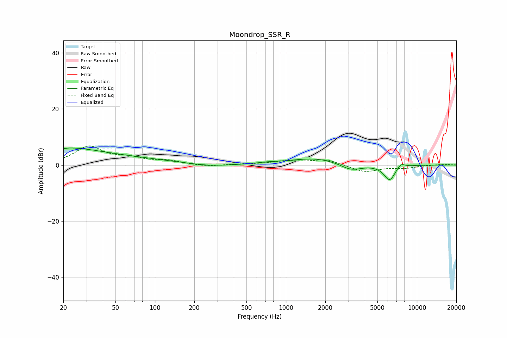

# Moondrop_SSR_R
See [usage instructions](https://github.com/jaakkopasanen/AutoEq#usage) for more options and info.

### Parametric EQs
Apply preamp of -6.2 dB when using parametric equalizer.

|   # | Type    |   Fc (Hz) |    Q |   Gain (dB) |
|-----|---------|-----------|------|-------------|
|   1 | Peaking |        20 | 5.64 |         3.4 |
|   2 | Peaking |        20 | 0.47 |         5.7 |
|   3 | Peaking |        20 | 5.71 |        -3.6 |
|   4 | Peaking |        77 | 0.44 |         1.4 |
|   5 | Peaking |       257 | 0.93 |        -0.8 |
|   6 | Peaking |       720 | 2.03 |         0.4 |
|   7 | Peaking |      1681 | 0.71 |         2.5 |
|   8 | Peaking |      3134 | 1.7  |        -2.5 |
|   9 | Peaking |      6200 | 3.15 |        -5.5 |
|  10 | Peaking |      7540 | 4.54 |         1.7 |

### Fixed Band EQs
When using fixed band (also called graphic) equalizer, apply preamp of **-6.9 dB** (if available) and set gains manually with these parameters.

|   # | Type    |   Fc (Hz) |    Q |   Gain (dB) |
|-----|---------|-----------|------|-------------|
|   1 | Peaking |        31 | 1.41 |         6.4 |
|   2 | Peaking |        62 | 1.41 |         2   |
|   3 | Peaking |       125 | 1.41 |         1.4 |
|   4 | Peaking |       250 | 1.41 |        -0.6 |
|   5 | Peaking |       500 | 1.41 |         0.2 |
|   6 | Peaking |      1000 | 1.41 |         1.3 |
|   7 | Peaking |      2000 | 1.41 |         2   |
|   8 | Peaking |      4000 | 1.41 |        -2.5 |
|   9 | Peaking |      8000 | 1.41 |        -1   |
|  10 | Peaking |     16000 | 1.41 |         0.3 |

### Graphs

