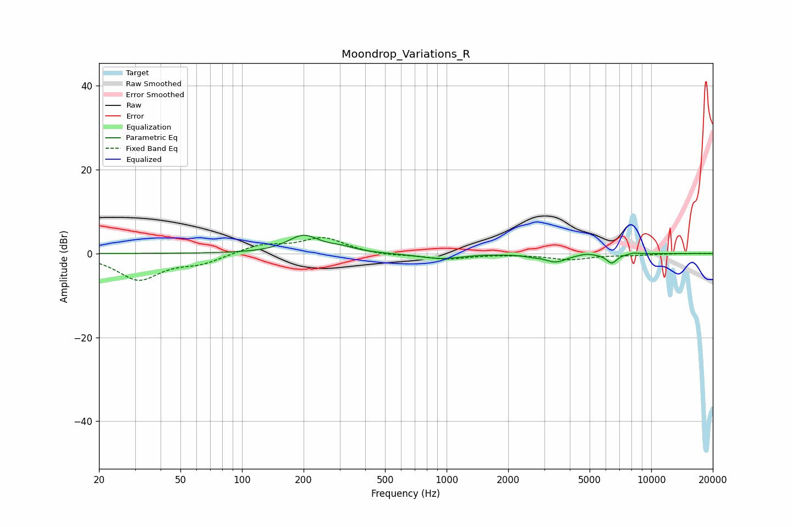

# Moondrop_Variations_R
See [usage instructions](https://github.com/jaakkopasanen/AutoEq#usage) for more options and info.

### Parametric EQs
Apply preamp of -4.4 dB when using parametric equalizer.

|   # | Type    |   Fc (Hz) |    Q |   Gain (dB) |
|-----|---------|-----------|------|-------------|
|   1 | Peaking |       200 | 1.81 |         4.2 |
|   2 | Peaking |       308 | 2.08 |         1   |
|   3 | Peaking |       941 | 1.27 |        -1.3 |
|   4 | Peaking |      1082 | 1.96 |        -0.2 |
|   5 | Peaking |      1183 | 1.59 |         0.2 |
|   6 | Peaking |      2602 | 4.28 |        -0.3 |
|   7 | Peaking |      3412 | 2.62 |        -1.9 |
|   8 | Peaking |      4812 | 4.17 |         0.4 |
|   9 | Peaking |      6414 | 5.32 |        -2.2 |
|  10 | Peaking |      8233 | 5.09 |         0.3 |

### Fixed Band EQs
When using fixed band (also called graphic) equalizer, apply preamp of **-3.9 dB** (if available) and set gains manually with these parameters.

|   # | Type    |   Fc (Hz) |    Q |   Gain (dB) |
|-----|---------|-----------|------|-------------|
|   1 | Peaking |        31 | 1.41 |        -6.1 |
|   2 | Peaking |        62 | 1.41 |        -2   |
|   3 | Peaking |       125 | 1.41 |         2.1 |
|   4 | Peaking |       250 | 1.41 |         3.7 |
|   5 | Peaking |       500 | 1.41 |        -0.5 |
|   6 | Peaking |      1000 | 1.41 |        -1.3 |
|   7 | Peaking |      2000 | 1.41 |        -0.1 |
|   8 | Peaking |      4000 | 1.41 |        -1.4 |
|   9 | Peaking |      8000 | 1.41 |        -0.3 |
|  10 | Peaking |     16000 | 1.41 |         0   |

### Graphs

