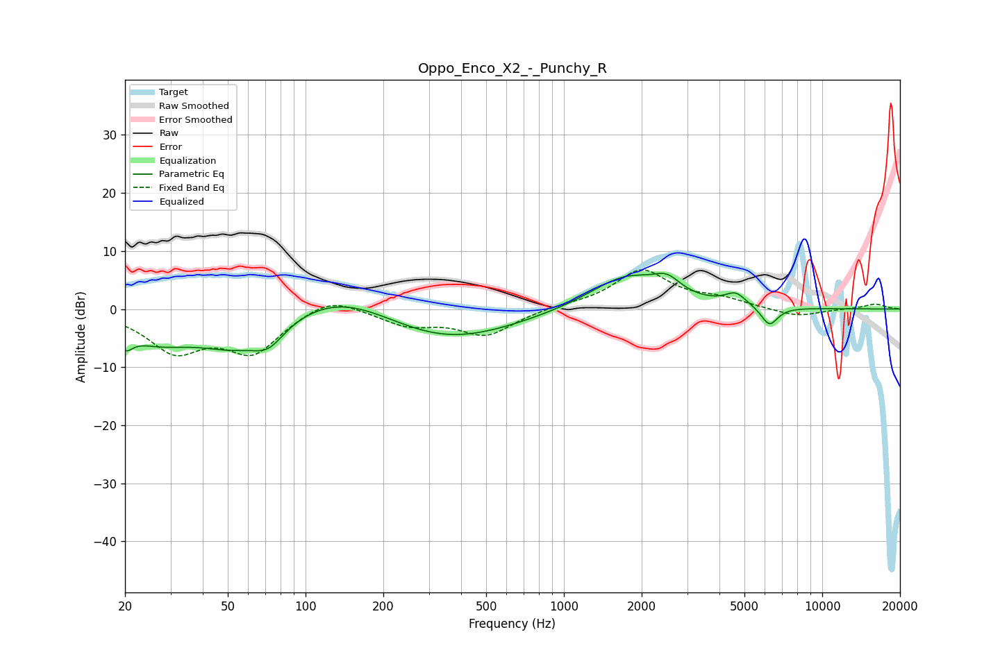

# Oppo_Enco_X2_-_Punchy_R
See [usage instructions](https://github.com/jaakkopasanen/AutoEq#usage) for more options and info.

### Parametric EQs
Apply preamp of -6.2 dB when using parametric equalizer.

|   # | Type    |   Fc (Hz) |    Q |   Gain (dB) |
|-----|---------|-----------|------|-------------|
|   1 | Peaking |        20 | 4.86 |        -3   |
|   2 | Peaking |        26 | 1.06 |        -4.1 |
|   3 | Peaking |        53 | 0.86 |        -6   |
|   4 | Peaking |        72 | 2.33 |        -3.2 |
|   5 | Peaking |       136 | 0.67 |         4.8 |
|   6 | Peaking |       344 | 0.52 |        -5.9 |
|   7 | Peaking |      1750 | 0.96 |         5.9 |
|   8 | Peaking |      2508 | 2.79 |         2.5 |
|   9 | Peaking |      4623 | 3.48 |         2.1 |
|  10 | Peaking |      6244 | 4.19 |        -3.3 |

### Fixed Band EQs
When using fixed band (also called graphic) equalizer, apply preamp of **-6.8 dB** (if available) and set gains manually with these parameters.

|   # | Type    |   Fc (Hz) |    Q |   Gain (dB) |
|-----|---------|-----------|------|-------------|
|   1 | Peaking |        31 | 1.41 |        -6.7 |
|   2 | Peaking |        62 | 1.41 |        -7   |
|   3 | Peaking |       125 | 1.41 |         2.8 |
|   4 | Peaking |       250 | 1.41 |        -2.6 |
|   5 | Peaking |       500 | 1.41 |        -4.4 |
|   6 | Peaking |      1000 | 1.41 |         0.5 |
|   7 | Peaking |      2000 | 1.41 |         6.6 |
|   8 | Peaking |      4000 | 1.41 |         1.4 |
|   9 | Peaking |      8000 | 1.41 |        -1.4 |
|  10 | Peaking |     16000 | 1.41 |         0.9 |

### Graphs

