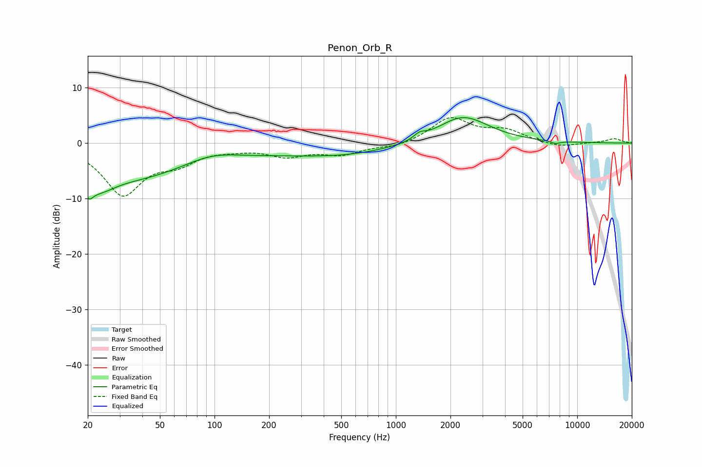

# Penon_Orb_R
See [usage instructions](https://github.com/jaakkopasanen/AutoEq#usage) for more options and info.

### Parametric EQs
Apply preamp of -4.7 dB when using parametric equalizer.

|   # | Type    |   Fc (Hz) |    Q |   Gain (dB) |
|-----|---------|-----------|------|-------------|
|   1 | Peaking |        20 | 5.74 |        -2.5 |
|   2 | Peaking |        23 | 1.58 |        -3.4 |
|   3 | Peaking |        34 | 0.44 |        -5.4 |
|   4 | Peaking |        95 | 0.92 |         1.9 |
|   5 | Peaking |       252 | 0.18 |        -2   |
|   6 | Peaking |       495 | 0.7  |        -0.5 |
|   7 | Peaking |      1339 | 4.9  |         0.7 |
|   8 | Peaking |      1399 | 4.46 |         0.3 |
|   9 | Peaking |      2328 | 0.97 |         5.1 |
|  10 | Peaking |      7590 | 5.04 |        -0.5 |

### Fixed Band EQs
When using fixed band (also called graphic) equalizer, apply preamp of **-4.7 dB** (if available) and set gains manually with these parameters.

|   # | Type    |   Fc (Hz) |    Q |   Gain (dB) |
|-----|---------|-----------|------|-------------|
|   1 | Peaking |        31 | 1.41 |        -9   |
|   2 | Peaking |        62 | 1.41 |        -2.8 |
|   3 | Peaking |       125 | 1.41 |        -0.7 |
|   4 | Peaking |       250 | 1.41 |        -2.1 |
|   5 | Peaking |       500 | 1.41 |        -1.8 |
|   6 | Peaking |      1000 | 1.41 |        -0.8 |
|   7 | Peaking |      2000 | 1.41 |         4.5 |
|   8 | Peaking |      4000 | 1.41 |         2.1 |
|   9 | Peaking |      8000 | 1.41 |        -0.8 |
|  10 | Peaking |     16000 | 1.41 |         0.8 |

### Graphs

