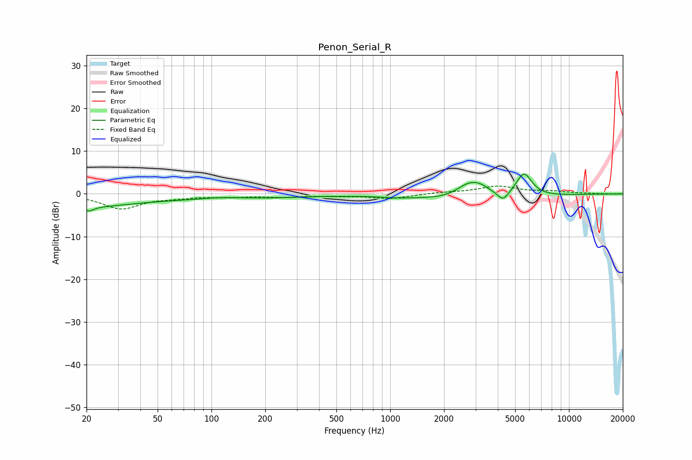

# Penon_Serial_R
See [usage instructions](https://github.com/jaakkopasanen/AutoEq#usage) for more options and info.

### Parametric EQs
Apply preamp of -4.7 dB when using parametric equalizer.

|   # | Type    |   Fc (Hz) |    Q |   Gain (dB) |
|-----|---------|-----------|------|-------------|
|   1 | Peaking |        20 | 0.55 |        -2.8 |
|   2 | Peaking |        21 | 5.39 |        -1.1 |
|   3 | Peaking |       115 | 1.07 |         0.7 |
|   4 | Peaking |       122 | 0.39 |        -1.3 |
|   5 | Peaking |      1075 | 2.11 |        -0.2 |
|   6 | Peaking |      2652 | 2.18 |         1.7 |
|   7 | Peaking |      2864 | 0.45 |        -1.8 |
|   8 | Peaking |      3081 | 1.92 |         3.1 |
|   9 | Peaking |      4280 | 4.76 |        -2.1 |
|  10 | Peaking |      5602 | 3.09 |         5.6 |

### Fixed Band EQs
When using fixed band (also called graphic) equalizer, apply preamp of **-1.9 dB** (if available) and set gains manually with these parameters.

|   # | Type    |   Fc (Hz) |    Q |   Gain (dB) |
|-----|---------|-----------|------|-------------|
|   1 | Peaking |        31 | 1.41 |        -3.4 |
|   2 | Peaking |        62 | 1.41 |        -0.6 |
|   3 | Peaking |       125 | 1.41 |        -0.6 |
|   4 | Peaking |       250 | 1.41 |        -0.6 |
|   5 | Peaking |       500 | 1.41 |        -0.4 |
|   6 | Peaking |      1000 | 1.41 |        -1.1 |
|   7 | Peaking |      2000 | 1.41 |         0.3 |
|   8 | Peaking |      4000 | 1.41 |         1.7 |
|   9 | Peaking |      8000 | 1.41 |         0.5 |
|  10 | Peaking |     16000 | 1.41 |        -0   |

### Graphs

