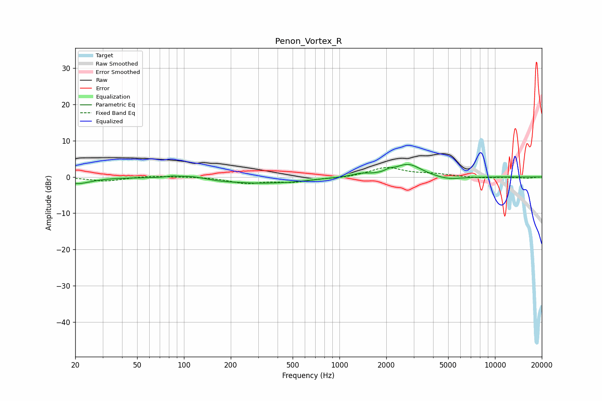

# Penon_Vortex_R
See [usage instructions](https://github.com/jaakkopasanen/AutoEq#usage) for more options and info.

### Parametric EQs
Apply preamp of -3.5 dB when using parametric equalizer.

|   # | Type    |   Fc (Hz) |    Q |   Gain (dB) |
|-----|---------|-----------|------|-------------|
|   1 | Peaking |        21 | 1.59 |        -1.8 |
|   2 | Peaking |        83 | 4.33 |         0.3 |
|   3 | Peaking |       113 | 1.16 |         1.4 |
|   4 | Peaking |       220 | 0.5  |        -2.1 |
|   5 | Peaking |       223 | 1.76 |         0.3 |
|   6 | Peaking |       499 | 1.15 |        -0.4 |
|   7 | Peaking |      1376 | 2.39 |         0.8 |
|   8 | Peaking |      2086 | 5.34 |         0.6 |
|   9 | Peaking |      2761 | 1.65 |         3.6 |
|  10 | Peaking |      4980 | 1.59 |        -1   |

### Fixed Band EQs
When using fixed band (also called graphic) equalizer, apply preamp of **-2.7 dB** (if available) and set gains manually with these parameters.

|   # | Type    |   Fc (Hz) |    Q |   Gain (dB) |
|-----|---------|-----------|------|-------------|
|   1 | Peaking |        31 | 1.41 |        -1.2 |
|   2 | Peaking |        62 | 1.41 |         0.4 |
|   3 | Peaking |       125 | 1.41 |         0.1 |
|   4 | Peaking |       250 | 1.41 |        -1.6 |
|   5 | Peaking |       500 | 1.41 |        -1.3 |
|   6 | Peaking |      1000 | 1.41 |        -0.3 |
|   7 | Peaking |      2000 | 1.41 |         2.6 |
|   8 | Peaking |      4000 | 1.41 |         0.7 |
|   9 | Peaking |      8000 | 1.41 |        -0.3 |
|  10 | Peaking |     16000 | 1.41 |        -0.4 |

### Graphs

