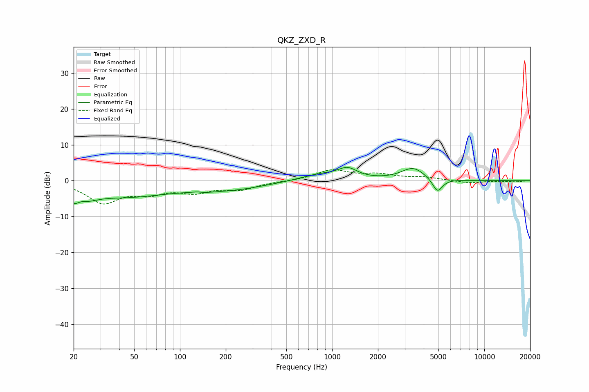

# QKZ_ZXD_R
See [usage instructions](https://github.com/jaakkopasanen/AutoEq#usage) for more options and info.

### Parametric EQs
Apply preamp of -3.8 dB when using parametric equalizer.

|   # | Type    |   Fc (Hz) |    Q |   Gain (dB) |
|-----|---------|-----------|------|-------------|
|   1 | Peaking |        20 | 4.8  |        -2.5 |
|   2 | Peaking |        25 | 2.12 |        -1.8 |
|   3 | Peaking |        42 | 0.46 |        -4.3 |
|   4 | Peaking |       130 | 4.5  |         0.3 |
|   5 | Peaking |       142 | 2.66 |        -0.4 |
|   6 | Peaking |       214 | 0.61 |        -2.1 |
|   7 | Peaking |       821 | 1.08 |         1.7 |
|   8 | Peaking |      1262 | 2.19 |         2.8 |
|   9 | Peaking |      3404 | 1.81 |         3.5 |
|  10 | Peaking |      4923 | 4.27 |        -3.9 |

### Fixed Band EQs
When using fixed band (also called graphic) equalizer, apply preamp of **-3.2 dB** (if available) and set gains manually with these parameters.

|   # | Type    |   Fc (Hz) |    Q |   Gain (dB) |
|-----|---------|-----------|------|-------------|
|   1 | Peaking |        31 | 1.41 |        -5.9 |
|   2 | Peaking |        62 | 1.41 |        -2.8 |
|   3 | Peaking |       125 | 1.41 |        -2.7 |
|   4 | Peaking |       250 | 1.41 |        -2.2 |
|   5 | Peaking |       500 | 1.41 |        -0.1 |
|   6 | Peaking |      1000 | 1.41 |         2.9 |
|   7 | Peaking |      2000 | 1.41 |         1.5 |
|   8 | Peaking |      4000 | 1.41 |         0.8 |
|   9 | Peaking |      8000 | 1.41 |        -0.7 |
|  10 | Peaking |     16000 | 1.41 |        -0.3 |

### Graphs

