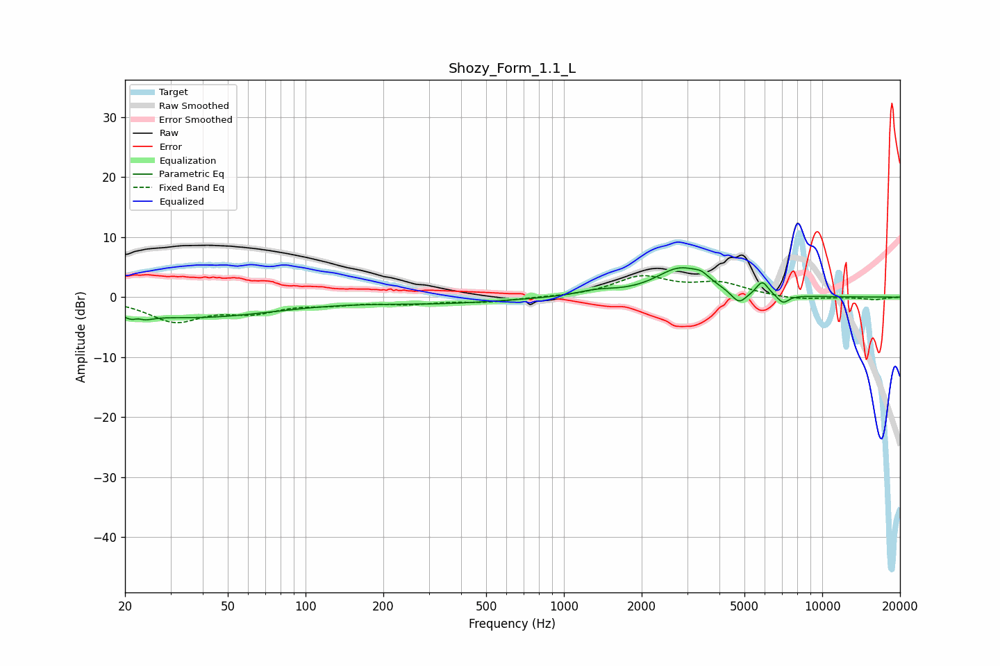

# Shozy_Form_1.1_L
See [usage instructions](https://github.com/jaakkopasanen/AutoEq#usage) for more options and info.

### Parametric EQs
Apply preamp of -5.0 dB when using parametric equalizer.

|   # | Type    |   Fc (Hz) |    Q |   Gain (dB) |
|-----|---------|-----------|------|-------------|
|   1 | Peaking |        22 | 4.28 |        -3.3 |
|   2 | Peaking |        22 | 6    |         2.4 |
|   3 | Peaking |        37 | 0.44 |        -3.3 |
|   4 | Peaking |       332 | 0.55 |        -0.9 |
|   5 | Peaking |      1335 | 1.91 |         0.8 |
|   6 | Peaking |      2832 | 1.46 |         4.7 |
|   7 | Peaking |      3417 | 4.93 |         0.9 |
|   8 | Peaking |      4760 | 4.59 |        -2.2 |
|   9 | Peaking |      5859 | 5.95 |         2.3 |
|  10 | Peaking |      7051 | 5.99 |        -1.4 |

### Fixed Band EQs
When using fixed band (also called graphic) equalizer, apply preamp of **-3.7 dB** (if available) and set gains manually with these parameters.

|   # | Type    |   Fc (Hz) |    Q |   Gain (dB) |
|-----|---------|-----------|------|-------------|
|   1 | Peaking |        31 | 1.41 |        -3.8 |
|   2 | Peaking |        62 | 1.41 |        -2.1 |
|   3 | Peaking |       125 | 1.41 |        -0.9 |
|   4 | Peaking |       250 | 1.41 |        -0.9 |
|   5 | Peaking |       500 | 1.41 |        -0.7 |
|   6 | Peaking |      1000 | 1.41 |        -0.1 |
|   7 | Peaking |      2000 | 1.41 |         3.3 |
|   8 | Peaking |      4000 | 1.41 |         2.1 |
|   9 | Peaking |      8000 | 1.41 |        -0.5 |
|  10 | Peaking |     16000 | 1.41 |        -0.4 |

### Graphs

