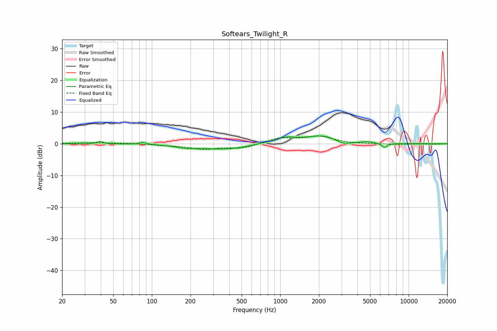

# Softears_Twilight_R
See [usage instructions](https://github.com/jaakkopasanen/AutoEq#usage) for more options and info.

### Parametric EQs
Apply preamp of -2.6 dB when using parametric equalizer.

|   # | Type    |   Fc (Hz) |    Q |   Gain (dB) |
|-----|---------|-----------|------|-------------|
|   1 | Peaking |        39 | 5.86 |         0.7 |
|   2 | Peaking |        85 | 5.99 |         0.7 |
|   3 | Peaking |       184 | 1.76 |        -0.7 |
|   4 | Peaking |       367 | 0.75 |        -1.7 |
|   5 | Peaking |       701 | 2.85 |         0.2 |
|   6 | Peaking |      1091 | 1.73 |         1.7 |
|   7 | Peaking |      2155 | 1.05 |         2.6 |
|   8 | Peaking |      3099 | 2.24 |        -1.4 |
|   9 | Peaking |      4815 | 3.02 |         0.4 |
|  10 | Peaking |      6488 | 5.99 |        -1.3 |

### Fixed Band EQs
When using fixed band (also called graphic) equalizer, apply preamp of **-2.6 dB** (if available) and set gains manually with these parameters.

|   # | Type    |   Fc (Hz) |    Q |   Gain (dB) |
|-----|---------|-----------|------|-------------|
|   1 | Peaking |        31 | 1.41 |         0.4 |
|   2 | Peaking |        62 | 1.41 |         0.2 |
|   3 | Peaking |       125 | 1.41 |        -0.3 |
|   4 | Peaking |       250 | 1.41 |        -1.6 |
|   5 | Peaking |       500 | 1.41 |        -1.4 |
|   6 | Peaking |      1000 | 1.41 |         1.8 |
|   7 | Peaking |      2000 | 1.41 |         2.2 |
|   8 | Peaking |      4000 | 1.41 |        -0.1 |
|   9 | Peaking |      8000 | 1.41 |        -0.2 |
|  10 | Peaking |     16000 | 1.41 |        -0.1 |

### Graphs

