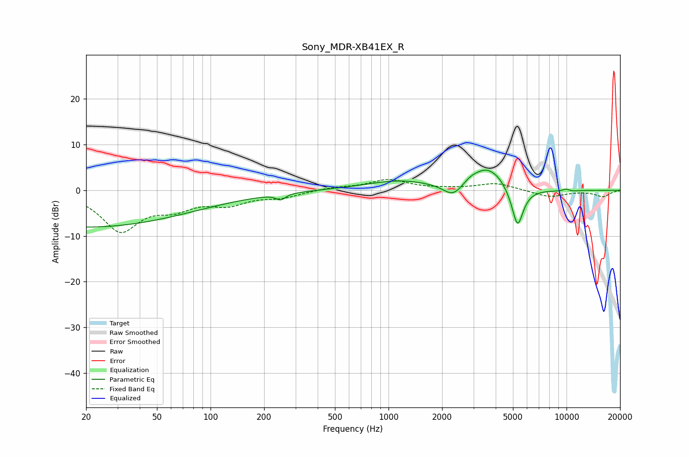

# Sony_MDR-XB41EX_R
See [usage instructions](https://github.com/jaakkopasanen/AutoEq#usage) for more options and info.

### Parametric EQs
Apply preamp of -4.5 dB when using parametric equalizer.

|   # | Type    |   Fc (Hz) |    Q |   Gain (dB) |
|-----|---------|-----------|------|-------------|
|   1 | Peaking |        20 | 0.22 |        -8   |
|   2 | Peaking |       248 | 5.56 |        -1.3 |
|   3 | Peaking |      1174 | 0.71 |         2.1 |
|   4 | Peaking |      2308 | 2.56 |        -2.8 |
|   5 | Peaking |      2910 | 2.73 |         1.7 |
|   6 | Peaking |      3535 | 2.29 |         3.2 |
|   7 | Peaking |      4150 | 2.47 |         1.7 |
|   8 | Peaking |      5309 | 4.3  |        -8.6 |
|   9 | Peaking |      9934 | 5.39 |         0.9 |
|  10 | Peaking |     10000 | 3.22 |        -0.6 |

### Fixed Band EQs
When using fixed band (also called graphic) equalizer, apply preamp of **-2.5 dB** (if available) and set gains manually with these parameters.

|   # | Type    |   Fc (Hz) |    Q |   Gain (dB) |
|-----|---------|-----------|------|-------------|
|   1 | Peaking |        31 | 1.41 |        -8.6 |
|   2 | Peaking |        62 | 1.41 |        -3.1 |
|   3 | Peaking |       125 | 1.41 |        -2.6 |
|   4 | Peaking |       250 | 1.41 |        -1.3 |
|   5 | Peaking |       500 | 1.41 |         0.6 |
|   6 | Peaking |      1000 | 1.41 |         2.3 |
|   7 | Peaking |      2000 | 1.41 |         0.2 |
|   8 | Peaking |      4000 | 1.41 |         1.6 |
|   9 | Peaking |      8000 | 1.41 |        -1.5 |
|  10 | Peaking |     16000 | 1.41 |        -1.3 |

### Graphs

