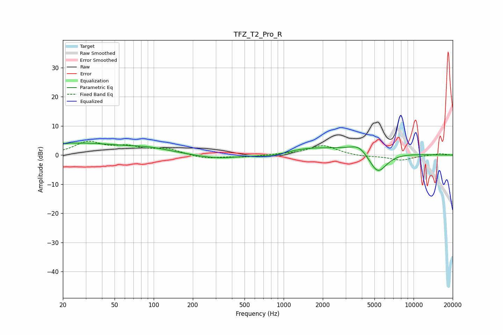

# TFZ_T2_Pro_R
See [usage instructions](https://github.com/jaakkopasanen/AutoEq#usage) for more options and info.

### Parametric EQs
Apply preamp of -4.2 dB when using parametric equalizer.

|   # | Type    |   Fc (Hz) |    Q |   Gain (dB) |
|-----|---------|-----------|------|-------------|
|   1 | Peaking |        20 | 4.64 |         3.7 |
|   2 | Peaking |        20 | 5.72 |        -3.2 |
|   3 | Peaking |        28 | 0.48 |         3.7 |
|   4 | Peaking |        92 | 0.81 |         1.7 |
|   5 | Peaking |       311 | 0.91 |        -1.3 |
|   6 | Peaking |       804 | 1.63 |        -0.8 |
|   7 | Peaking |      1528 | 0.86 |         1.7 |
|   8 | Peaking |      3811 | 2.45 |         2   |
|   9 | Peaking |      4072 | 0.65 |         3.3 |
|  10 | Peaking |      5291 | 1.82 |        -8.7 |

### Fixed Band EQs
When using fixed band (also called graphic) equalizer, apply preamp of **-4.9 dB** (if available) and set gains manually with these parameters.

|   # | Type    |   Fc (Hz) |    Q |   Gain (dB) |
|-----|---------|-----------|------|-------------|
|   1 | Peaking |        31 | 1.41 |         4.3 |
|   2 | Peaking |        62 | 1.41 |         2.4 |
|   3 | Peaking |       125 | 1.41 |         2   |
|   4 | Peaking |       250 | 1.41 |        -1.3 |
|   5 | Peaking |       500 | 1.41 |        -0.6 |
|   6 | Peaking |      1000 | 1.41 |         0.2 |
|   7 | Peaking |      2000 | 1.41 |         3.4 |
|   8 | Peaking |      4000 | 1.41 |        -0.5 |
|   9 | Peaking |      8000 | 1.41 |        -1.7 |
|  10 | Peaking |     16000 | 1.41 |         0.5 |

### Graphs

