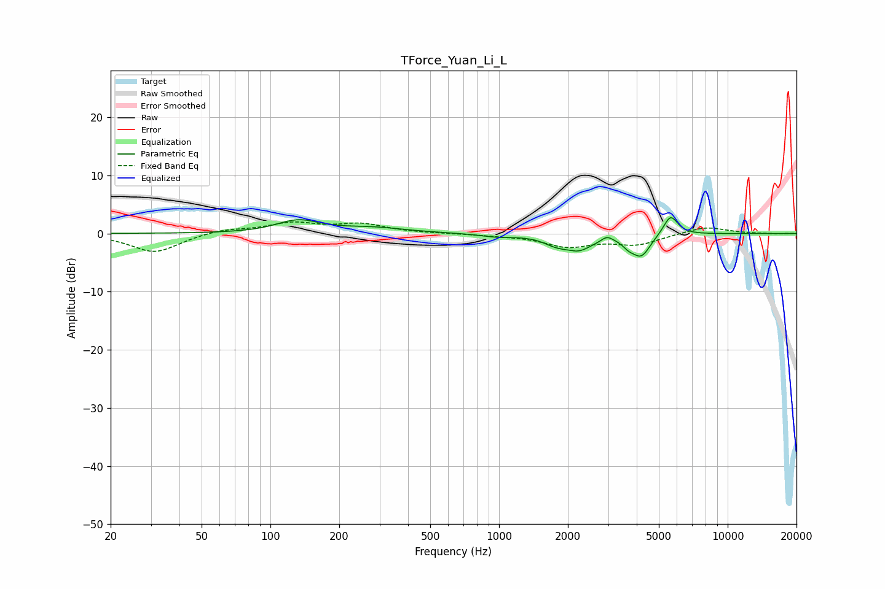

# TForce_Yuan_Li_L
See [usage instructions](https://github.com/jaakkopasanen/AutoEq#usage) for more options and info.

### Parametric EQs
Apply preamp of -2.8 dB when using parametric equalizer.

|   # | Type    |   Fc (Hz) |    Q |   Gain (dB) |
|-----|---------|-----------|------|-------------|
|   1 | Peaking |       132 | 1.54 |         2.1 |
|   2 | Peaking |       278 | 0.98 |         0.9 |
|   3 | Peaking |       977 | 1.97 |        -0.5 |
|   4 | Peaking |      1726 | 3.18 |        -0.7 |
|   5 | Peaking |      2056 | 5.46 |         0.3 |
|   6 | Peaking |      2157 | 2.01 |        -3   |
|   7 | Peaking |      2965 | 5.66 |         0.9 |
|   8 | Peaking |      3683 | 5.74 |        -1   |
|   9 | Peaking |      4186 | 3.49 |        -3.7 |
|  10 | Peaking |      5626 | 4.37 |         3.5 |

### Fixed Band EQs
When using fixed band (also called graphic) equalizer, apply preamp of **-2.1 dB** (if available) and set gains manually with these parameters.

|   # | Type    |   Fc (Hz) |    Q |   Gain (dB) |
|-----|---------|-----------|------|-------------|
|   1 | Peaking |        31 | 1.41 |        -3.3 |
|   2 | Peaking |        62 | 1.41 |         0.8 |
|   3 | Peaking |       125 | 1.41 |         1.7 |
|   4 | Peaking |       250 | 1.41 |         1.5 |
|   5 | Peaking |       500 | 1.41 |         0   |
|   6 | Peaking |      1000 | 1.41 |        -0.2 |
|   7 | Peaking |      2000 | 1.41 |        -2.1 |
|   8 | Peaking |      4000 | 1.41 |        -1.8 |
|   9 | Peaking |      8000 | 1.41 |         1.2 |
|  10 | Peaking |     16000 | 1.41 |        -0.1 |

### Graphs

