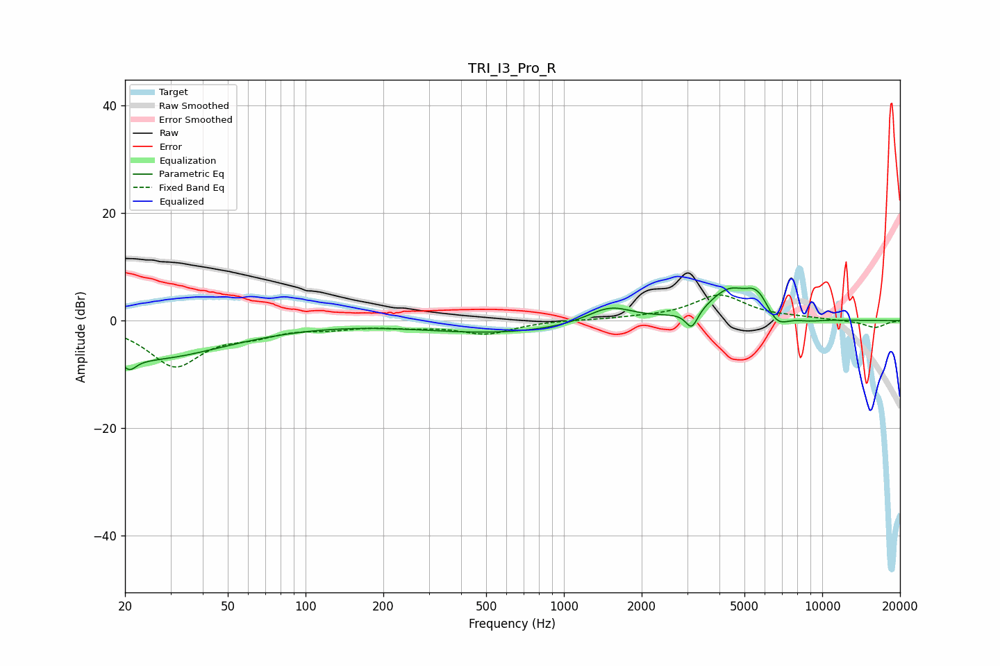

# TRI_I3_Pro_R
See [usage instructions](https://github.com/jaakkopasanen/AutoEq#usage) for more options and info.

### Parametric EQs
Apply preamp of -6.2 dB when using parametric equalizer.

|   # | Type    |   Fc (Hz) |    Q |   Gain (dB) |
|-----|---------|-----------|------|-------------|
|   1 | Peaking |        21 | 5.31 |        -2.2 |
|   2 | Peaking |        24 | 0.46 |        -7   |
|   3 | Peaking |       564 | 0.46 |        -2.3 |
|   4 | Peaking |      1508 | 1.58 |         3.1 |
|   5 | Peaking |      3125 | 5.93 |        -3.5 |
|   6 | Peaking |      4399 | 1.68 |         5.8 |
|   7 | Peaking |      5307 | 5.18 |         0.9 |
|   8 | Peaking |      5722 | 3.82 |         2.7 |
|   9 | Peaking |      6715 | 3.3  |        -2.4 |
|  10 | Peaking |      8893 | 2.31 |        -0.4 |

### Fixed Band EQs
When using fixed band (also called graphic) equalizer, apply preamp of **-4.9 dB** (if available) and set gains manually with these parameters.

|   # | Type    |   Fc (Hz) |    Q |   Gain (dB) |
|-----|---------|-----------|------|-------------|
|   1 | Peaking |        31 | 1.41 |        -8.2 |
|   2 | Peaking |        62 | 1.41 |        -1.9 |
|   3 | Peaking |       125 | 1.41 |        -1.1 |
|   4 | Peaking |       250 | 1.41 |        -0.8 |
|   5 | Peaking |       500 | 1.41 |        -2.3 |
|   6 | Peaking |      1000 | 1.41 |         0.1 |
|   7 | Peaking |      2000 | 1.41 |         0.3 |
|   8 | Peaking |      4000 | 1.41 |         4.7 |
|   9 | Peaking |      8000 | 1.41 |         0.4 |
|  10 | Peaking |     16000 | 1.41 |        -1.3 |

### Graphs

