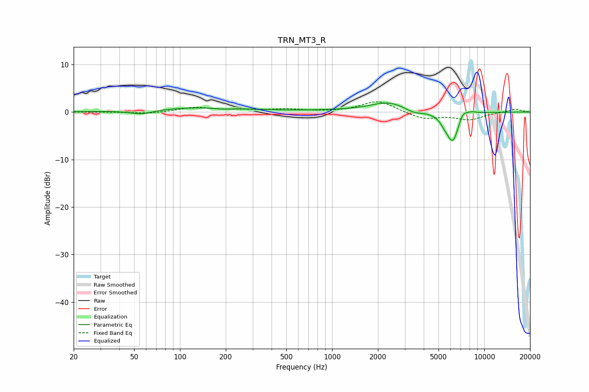

# TRN_MT3_R
See [usage instructions](https://github.com/jaakkopasanen/AutoEq#usage) for more options and info.

### Parametric EQs
Apply preamp of -2.0 dB when using parametric equalizer.

|   # | Type    |   Fc (Hz) |    Q |   Gain (dB) |
|-----|---------|-----------|------|-------------|
|   1 | Peaking |        56 | 1.85 |        -0.9 |
|   2 | Peaking |       131 | 0.42 |         0.9 |
|   3 | Peaking |       191 | 3.25 |        -0.2 |
|   4 | Peaking |      1192 | 0.57 |         0.3 |
|   5 | Peaking |      2350 | 1.24 |         2   |
|   6 | Peaking |      3446 | 2.52 |        -0.8 |
|   7 | Peaking |      5514 | 4.31 |        -1.2 |
|   8 | Peaking |      6217 | 3.51 |        -6   |
|   9 | Peaking |      7208 | 5.28 |         1.5 |
|  10 | Peaking |      8149 | 3.6  |         0.6 |

### Fixed Band EQs
When using fixed band (also called graphic) equalizer, apply preamp of **-2.2 dB** (if available) and set gains manually with these parameters.

|   # | Type    |   Fc (Hz) |    Q |   Gain (dB) |
|-----|---------|-----------|------|-------------|
|   1 | Peaking |        31 | 1.41 |         0   |
|   2 | Peaking |        62 | 1.41 |        -0.4 |
|   3 | Peaking |       125 | 1.41 |         1   |
|   4 | Peaking |       250 | 1.41 |         0.4 |
|   5 | Peaking |       500 | 1.41 |         0.5 |
|   6 | Peaking |      1000 | 1.41 |        -0   |
|   7 | Peaking |      2000 | 1.41 |         2.4 |
|   8 | Peaking |      4000 | 1.41 |        -1.5 |
|   9 | Peaking |      8000 | 1.41 |        -1.5 |
|  10 | Peaking |     16000 | 1.41 |         0.7 |

### Graphs

