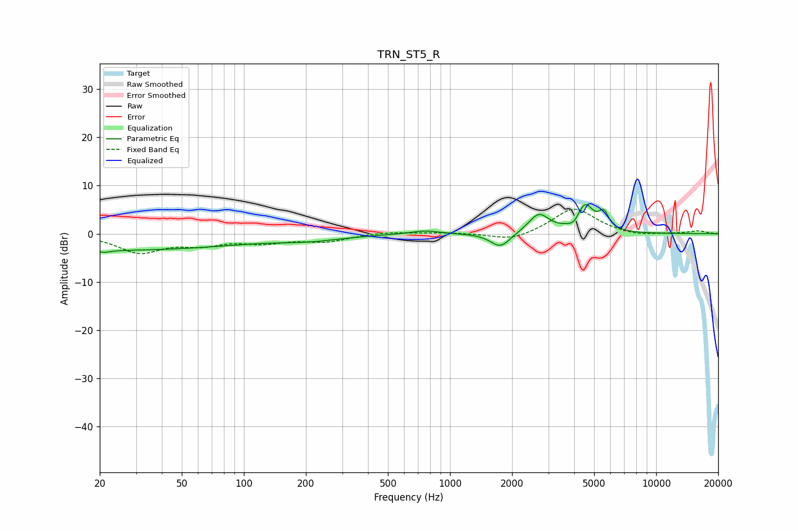

# TRN_ST5_R
See [usage instructions](https://github.com/jaakkopasanen/AutoEq#usage) for more options and info.

### Parametric EQs
Apply preamp of -6.1 dB when using parametric equalizer.

|   # | Type    |   Fc (Hz) |    Q |   Gain (dB) |
|-----|---------|-----------|------|-------------|
|   1 | Peaking |        21 | 5.81 |        -2.9 |
|   2 | Peaking |        21 | 5.99 |         2.5 |
|   3 | Peaking |        22 | 0.2  |        -3.4 |
|   4 | Peaking |       211 | 0.92 |        -1   |
|   5 | Peaking |       754 | 2.04 |         0.8 |
|   6 | Peaking |      1757 | 2.95 |        -3   |
|   7 | Peaking |      2696 | 2.86 |         4   |
|   8 | Peaking |      4009 | 5.43 |        -1.3 |
|   9 | Peaking |      4510 | 3.32 |         5.8 |
|  10 | Peaking |      5573 | 5.94 |         3.2 |

### Fixed Band EQs
When using fixed band (also called graphic) equalizer, apply preamp of **-5.2 dB** (if available) and set gains manually with these parameters.

|   # | Type    |   Fc (Hz) |    Q |   Gain (dB) |
|-----|---------|-----------|------|-------------|
|   1 | Peaking |        31 | 1.41 |        -3.7 |
|   2 | Peaking |        62 | 1.41 |        -1.9 |
|   3 | Peaking |       125 | 1.41 |        -1.6 |
|   4 | Peaking |       250 | 1.41 |        -1.5 |
|   5 | Peaking |       500 | 1.41 |         0.4 |
|   6 | Peaking |      1000 | 1.41 |         0.2 |
|   7 | Peaking |      2000 | 1.41 |        -1.6 |
|   8 | Peaking |      4000 | 1.41 |         5.4 |
|   9 | Peaking |      8000 | 1.41 |        -0.6 |
|  10 | Peaking |     16000 | 1.41 |         0.6 |

### Graphs

