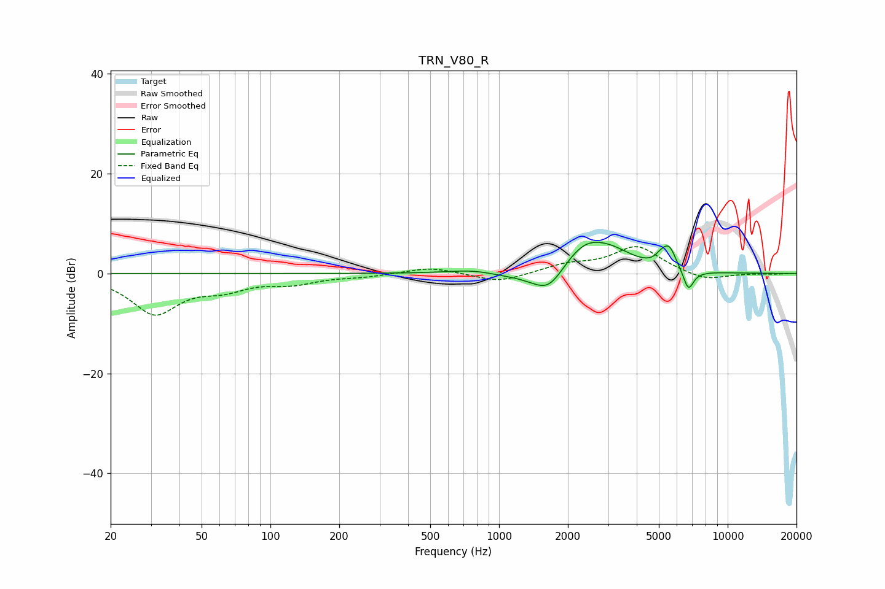

# TRN_V80_R
See [usage instructions](https://github.com/jaakkopasanen/AutoEq#usage) for more options and info.

### Parametric EQs
Apply preamp of -6.3 dB when using parametric equalizer.

|   # | Type    |   Fc (Hz) |    Q |   Gain (dB) |
|-----|---------|-----------|------|-------------|
|   1 | Peaking |       759 | 1.37 |         0.6 |
|   2 | Peaking |      1021 | 2.09 |        -0.3 |
|   3 | Peaking |      1360 | 1.6  |        -0.8 |
|   4 | Peaking |      1654 | 1.99 |        -5   |
|   5 | Peaking |      2375 | 1.32 |         6   |
|   6 | Peaking |      3160 | 1.5  |         2.4 |
|   7 | Peaking |      5102 | 6    |         1.1 |
|   8 | Peaking |      5547 | 4.44 |         4.4 |
|   9 | Peaking |      6732 | 5.99 |        -4.1 |
|  10 | Peaking |      7068 | 1.96 |        -0.3 |

### Fixed Band EQs
When using fixed band (also called graphic) equalizer, apply preamp of **-5.5 dB** (if available) and set gains manually with these parameters.

|   # | Type    |   Fc (Hz) |    Q |   Gain (dB) |
|-----|---------|-----------|------|-------------|
|   1 | Peaking |        31 | 1.41 |        -7.8 |
|   2 | Peaking |        62 | 1.41 |        -2.4 |
|   3 | Peaking |       125 | 1.41 |        -1.7 |
|   4 | Peaking |       250 | 1.41 |        -0.6 |
|   5 | Peaking |       500 | 1.41 |         1.3 |
|   6 | Peaking |      1000 | 1.41 |        -1.9 |
|   7 | Peaking |      2000 | 1.41 |         1.6 |
|   8 | Peaking |      4000 | 1.41 |         5.4 |
|   9 | Peaking |      8000 | 1.41 |        -1.6 |
|  10 | Peaking |     16000 | 1.41 |        -0.1 |

### Graphs

