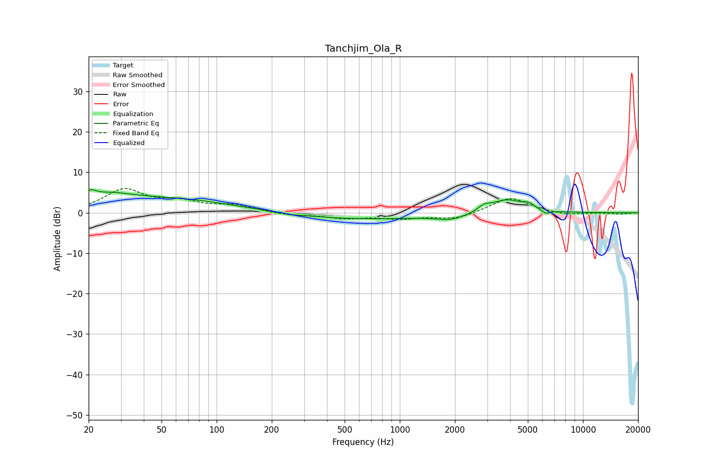

# Tanchjim_Ola_R
See [usage instructions](https://github.com/jaakkopasanen/AutoEq#usage) for more options and info.

### Parametric EQs
Apply preamp of -5.8 dB when using parametric equalizer.

|   # | Type    |   Fc (Hz) |    Q |   Gain (dB) |
|-----|---------|-----------|------|-------------|
|   1 | Peaking |        21 | 5.15 |         1.6 |
|   2 | Peaking |        26 | 1.47 |         1.3 |
|   3 | Peaking |        45 | 0.26 |         4   |
|   4 | Peaking |       265 | 5.98 |        -0.2 |
|   5 | Peaking |       449 | 0.25 |        -1.8 |
|   6 | Peaking |      1916 | 1.87 |        -1.3 |
|   7 | Peaking |      2890 | 4.22 |         1.3 |
|   8 | Peaking |      3828 | 1.65 |         3.3 |
|   9 | Peaking |      5061 | 4.44 |         1.2 |
|  10 | Peaking |      6277 | 5.94 |        -0.9 |

### Fixed Band EQs
When using fixed band (also called graphic) equalizer, apply preamp of **-6.1 dB** (if available) and set gains manually with these parameters.

|   # | Type    |   Fc (Hz) |    Q |   Gain (dB) |
|-----|---------|-----------|------|-------------|
|   1 | Peaking |        31 | 1.41 |         5.5 |
|   2 | Peaking |        62 | 1.41 |         2.3 |
|   3 | Peaking |       125 | 1.41 |         1.7 |
|   4 | Peaking |       250 | 1.41 |        -0.6 |
|   5 | Peaking |       500 | 1.41 |        -1.2 |
|   6 | Peaking |      1000 | 1.41 |        -1.3 |
|   7 | Peaking |      2000 | 1.41 |        -1.6 |
|   8 | Peaking |      4000 | 1.41 |         3.9 |
|   9 | Peaking |      8000 | 1.41 |        -0.7 |
|  10 | Peaking |     16000 | 1.41 |        -0.3 |

### Graphs

