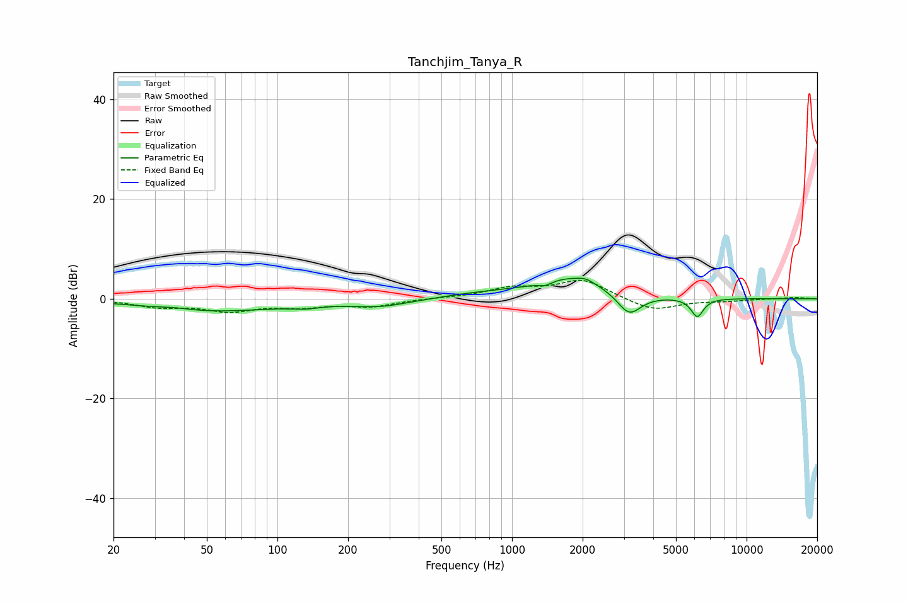

# Tanchjim_Tanya_R
See [usage instructions](https://github.com/jaakkopasanen/AutoEq#usage) for more options and info.

### Parametric EQs
Apply preamp of -4.2 dB when using parametric equalizer.

|   # | Type    |   Fc (Hz) |    Q |   Gain (dB) |
|-----|---------|-----------|------|-------------|
|   1 | Peaking |        36 | 2.59 |         0.3 |
|   2 | Peaking |        54 | 0.5  |        -2.4 |
|   3 | Peaking |       132 | 2.3  |        -0.6 |
|   4 | Peaking |       275 | 1.1  |        -1.4 |
|   5 | Peaking |       755 | 0.79 |         0.9 |
|   6 | Peaking |      1388 | 5.49 |        -0.7 |
|   7 | Peaking |      1832 | 0.94 |         4.1 |
|   8 | Peaking |      2058 | 4.54 |         0.6 |
|   9 | Peaking |      3158 | 2.74 |        -4.6 |
|  10 | Peaking |      6163 | 5.23 |        -3.7 |

### Fixed Band EQs
When using fixed band (also called graphic) equalizer, apply preamp of **-3.8 dB** (if available) and set gains manually with these parameters.

|   # | Type    |   Fc (Hz) |    Q |   Gain (dB) |
|-----|---------|-----------|------|-------------|
|   1 | Peaking |        31 | 1.41 |        -1.5 |
|   2 | Peaking |        62 | 1.41 |        -2.2 |
|   3 | Peaking |       125 | 1.41 |        -1.3 |
|   4 | Peaking |       250 | 1.41 |        -1.4 |
|   5 | Peaking |       500 | 1.41 |         0.1 |
|   6 | Peaking |      1000 | 1.41 |         2   |
|   7 | Peaking |      2000 | 1.41 |         3.7 |
|   8 | Peaking |      4000 | 1.41 |        -2.5 |
|   9 | Peaking |      8000 | 1.41 |        -0.4 |
|  10 | Peaking |     16000 | 1.41 |         0.3 |

### Graphs

