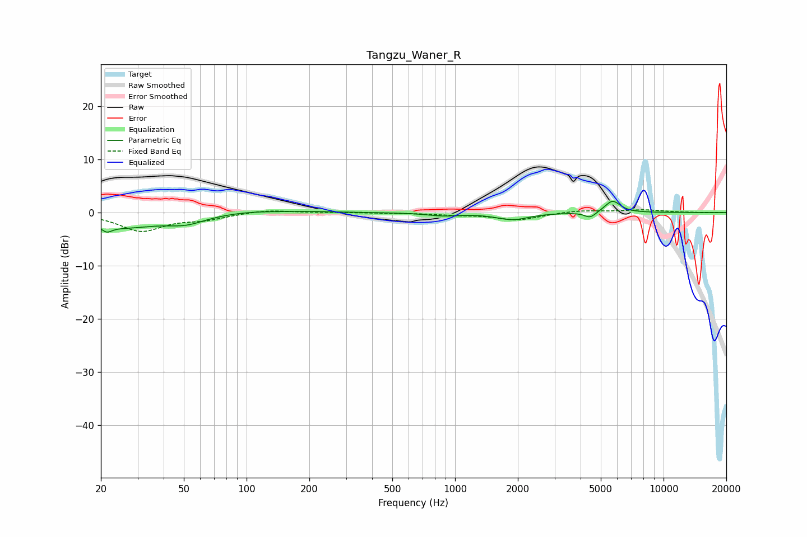

# Tangzu_Waner_R
See [usage instructions](https://github.com/jaakkopasanen/AutoEq#usage) for more options and info.

### Parametric EQs
Apply preamp of -2.2 dB when using parametric equalizer.

|   # | Type    |   Fc (Hz) |    Q |   Gain (dB) |
|-----|---------|-----------|------|-------------|
|   1 | Peaking |        21 | 5.96 |        -3.4 |
|   2 | Peaking |        21 | 5.95 |         2.3 |
|   3 | Peaking |        25 | 0.76 |        -2.7 |
|   4 | Peaking |        51 | 1.6  |        -1.4 |
|   5 | Peaking |       104 | 1.04 |         0.4 |
|   6 | Peaking |       197 | 1.15 |         0.2 |
|   7 | Peaking |       875 | 1.82 |        -0.5 |
|   8 | Peaking |      1888 | 1.8  |        -1.3 |
|   9 | Peaking |      4449 | 5.06 |        -1.1 |
|  10 | Peaking |      5692 | 3.78 |         2.3 |

### Fixed Band EQs
When using fixed band (also called graphic) equalizer, apply preamp of **-0.6 dB** (if available) and set gains manually with these parameters.

|   # | Type    |   Fc (Hz) |    Q |   Gain (dB) |
|-----|---------|-----------|------|-------------|
|   1 | Peaking |        31 | 1.41 |        -3.4 |
|   2 | Peaking |        62 | 1.41 |        -1.1 |
|   3 | Peaking |       125 | 1.41 |         0.6 |
|   4 | Peaking |       250 | 1.41 |         0   |
|   5 | Peaking |       500 | 1.41 |        -0.1 |
|   6 | Peaking |      1000 | 1.41 |        -0.3 |
|   7 | Peaking |      2000 | 1.41 |        -1.4 |
|   8 | Peaking |      4000 | 1.41 |         0.4 |
|   9 | Peaking |      8000 | 1.41 |         0.5 |
|  10 | Peaking |     16000 | 1.41 |        -0.1 |

### Graphs

