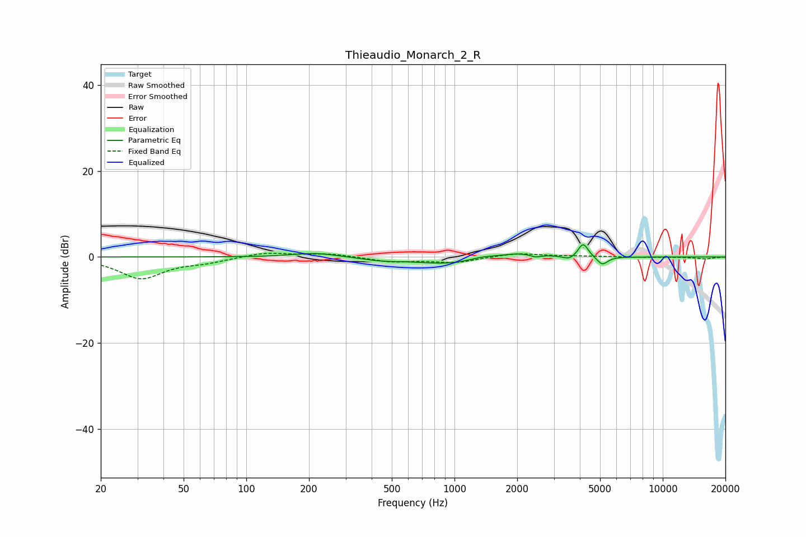

# Thieaudio_Monarch_2_R
See [usage instructions](https://github.com/jaakkopasanen/AutoEq#usage) for more options and info.

### Parametric EQs
Apply preamp of -2.9 dB when using parametric equalizer.

|   # | Type    |   Fc (Hz) |    Q |   Gain (dB) |
|-----|---------|-----------|------|-------------|
|   1 | Peaking |       214 | 1.33 |         1   |
|   2 | Peaking |       452 | 1.42 |        -0.7 |
|   3 | Peaking |       929 | 0.95 |        -1.6 |
|   4 | Peaking |      1351 | 2.35 |         0.5 |
|   5 | Peaking |      2042 | 1.29 |         1.1 |
|   6 | Peaking |      2448 | 6    |        -0.6 |
|   7 | Peaking |      3564 | 4.93 |        -0.9 |
|   8 | Peaking |      4140 | 6    |         2.6 |
|   9 | Peaking |      4181 | 6    |         0.7 |
|  10 | Peaking |      5127 | 5.45 |        -2   |

### Fixed Band EQs
When using fixed band (also called graphic) equalizer, apply preamp of **-1.0 dB** (if available) and set gains manually with these parameters.

|   # | Type    |   Fc (Hz) |    Q |   Gain (dB) |
|-----|---------|-----------|------|-------------|
|   1 | Peaking |        31 | 1.41 |        -4.9 |
|   2 | Peaking |        62 | 1.41 |        -1   |
|   3 | Peaking |       125 | 1.41 |         1.1 |
|   4 | Peaking |       250 | 1.41 |         0.8 |
|   5 | Peaking |       500 | 1.41 |        -1.1 |
|   6 | Peaking |      1000 | 1.41 |        -1.3 |
|   7 | Peaking |      2000 | 1.41 |         0.9 |
|   8 | Peaking |      4000 | 1.41 |         0.2 |
|   9 | Peaking |      8000 | 1.41 |        -0.1 |
|  10 | Peaking |     16000 | 1.41 |        -0.4 |

### Graphs

