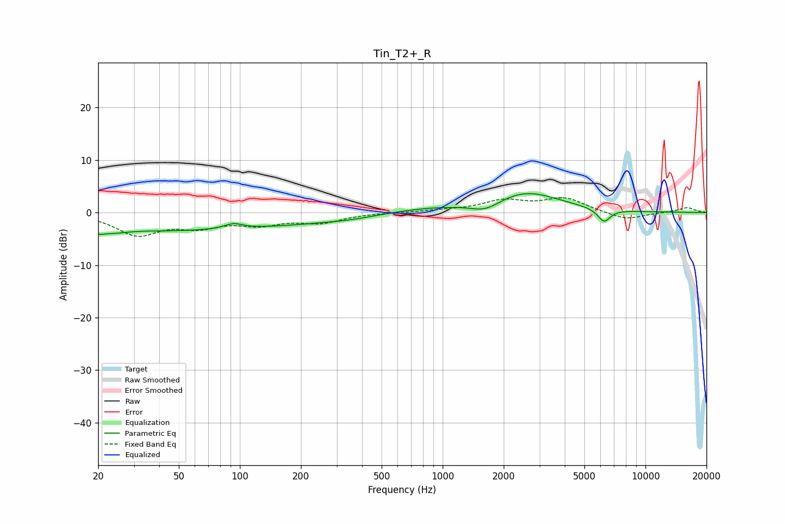

# Tin_T2+_R
See [usage instructions](https://github.com/jaakkopasanen/AutoEq#usage) for more options and info.

### Parametric EQs
Apply preamp of -3.7 dB when using parametric equalizer.

|   # | Type    |   Fc (Hz) |    Q |   Gain (dB) |
|-----|---------|-----------|------|-------------|
|   1 | Peaking |        20 | 5.8  |        -0.8 |
|   2 | Peaking |        23 | 1.71 |        -1.3 |
|   3 | Peaking |        33 | 0.45 |        -2.2 |
|   4 | Peaking |        93 | 3.27 |         1   |
|   5 | Peaking |       127 | 0.34 |        -2.2 |
|   6 | Peaking |       363 | 1.05 |        -0.4 |
|   7 | Peaking |       784 | 0.62 |         0.9 |
|   8 | Peaking |      1625 | 1.9  |        -1.9 |
|   9 | Peaking |      2560 | 0.83 |         3.9 |
|  10 | Peaking |      6247 | 4.39 |        -2.5 |

### Fixed Band EQs
When using fixed band (also called graphic) equalizer, apply preamp of **-2.9 dB** (if available) and set gains manually with these parameters.

|   # | Type    |   Fc (Hz) |    Q |   Gain (dB) |
|-----|---------|-----------|------|-------------|
|   1 | Peaking |        31 | 1.41 |        -4   |
|   2 | Peaking |        62 | 1.41 |        -2.3 |
|   3 | Peaking |       125 | 1.41 |        -1.9 |
|   4 | Peaking |       250 | 1.41 |        -1.7 |
|   5 | Peaking |       500 | 1.41 |         0   |
|   6 | Peaking |      1000 | 1.41 |         0.3 |
|   7 | Peaking |      2000 | 1.41 |         2.1 |
|   8 | Peaking |      4000 | 1.41 |         2.6 |
|   9 | Peaking |      8000 | 1.41 |        -1.5 |
|  10 | Peaking |     16000 | 1.41 |         1   |

### Graphs

